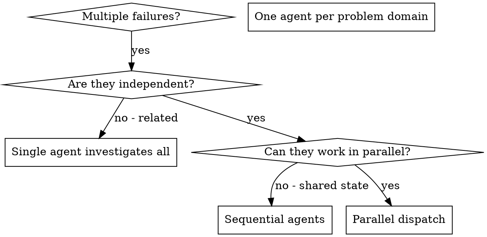

# Dispatching Parallel Agents

## Prodige Integration

**Auto-Loaded By:** `/parallel` command workflow  
**Required For:** Orchestrator Agent  
**Integrated Systems:**
- **Snapshot System:** `.ai/runtime/snapshots/` (freeze baseline)
- **Worktree System:** `.ai/runtime/worktrees/` (isolated workspaces)
- **Session System:** `.ai/runtime/sessions/` (agent coordination)
- **Lock System:** `.ai/runtime/locks/` (file conflict prevention)
- **Handoff System:** `.ai/runtime/handoffs/` (completion signals)

**Orchestrator Responsibilities:**
1. Create snapshot (baseline state)
2. Set up worktrees (one per agent)
3. Assign tasks via session configs
4. Establish file locks
5. Dispatch agents simultaneously
6. Monitor handoffs
7. Coordinate merge via Reviewer

**Agent Coordination:**
- Backend Agent → `.ai/runtime/worktrees/backend-agent/`
- Frontend Agent → `.ai/runtime/worktrees/frontend-agent/`
- QA Agent → `.ai/runtime/worktrees/qa-agent/`

Each agent receives:
- Task brief: `.ai/runtime/briefs/task-{N}-brief.md`
- Session config: `.ai/runtime/sessions/session-{agent}-{timestamp}.json`
- File locks: `.ai/runtime/locks/{file-path}.lock`
- Handoff template: `.ai/runtime/handoffs/{agent}-handoff.md`

## Overview

You delegate tasks to specialized agents with isolated context. By precisely crafting their instructions and context, you ensure they stay focused and succeed at their task. They should never inherit your session's context or history — you construct exactly what they need. This also preserves your own context for coordination work.

When you have multiple unrelated failures (different test files, different subsystems, different bugs), investigating them sequentially wastes time. Each investigation is independent and can happen in parallel.

**Core principle:** Dispatch one agent per independent problem domain. Let them work concurrently.

**Prodige Enhancement:** In Prodige workflow, parallel agent dispatch is managed through the `/parallel` command, which creates formal snapshots, isolated sessions, resource locks, and structured handoffs. The Orchestrator agent coordinates this infrastructure, while the Reviewer agent integrates the results and resolves any conflicts.

## Prodige Parallel Workflow (7 Phases)

### Phase 1: Problem Analysis
Orchestrator identifies independent domains:
- Task 1: Auth endpoint (Backend) - files: src/api/auth/*, tests/auth/*
- Task 2: Login UI (Frontend) - files: src/components/Login.tsx, tests/Login.test.tsx
- Task 3: E2E test (QA) - files: tests/e2e/login.spec.ts

Verify independence:
- ✅ No shared files
- ✅ No dependencies (Task 2 doesn't need Task 1 complete)
- ✅ Can work simultaneously

### Phase 2: Snapshot Creation
```bash
TIMESTAMP=$(date +%Y%m%d-%H%M%S)
SNAPSHOT_ID="snapshot-$TIMESTAMP"
mkdir -p .ai/runtime/snapshots/$SNAPSHOT_ID

# Capture state
git rev-parse HEAD > .ai/runtime/snapshots/$SNAPSHOT_ID/commit.txt
git status --porcelain > .ai/runtime/snapshots/$SNAPSHOT_ID/status.txt

# Capture context
cp .ai/context/{ARCHITECTURE,PRD,DECISIONS}.md .ai/runtime/snapshots/$SNAPSHOT_ID/
```

### Phase 3: Worktree Setup
```bash
COMMIT=$(cat .ai/runtime/snapshots/$SNAPSHOT_ID/commit.txt)

git worktree add .ai/runtime/worktrees/backend-agent -b parallel/backend $COMMIT
git worktree add .ai/runtime/worktrees/frontend-agent -b parallel/frontend $COMMIT
git worktree add .ai/runtime/worktrees/qa-agent -b parallel/qa $COMMIT
```

### Phase 4: Session Assignment
```bash
# Backend Agent session
cat > .ai/runtime/sessions/session-backend-$TIMESTAMP.json <<EOF
{
  "agentName": "backend-agent",
  "taskBrief": ".ai/runtime/briefs/task-001-brief.md",
  "worktree": ".ai/runtime/worktrees/backend-agent",
  "assignedFiles": ["src/api/auth/*", "tests/auth/*"],
  "locks": ["src/api/auth/login.ts"],
  "expectedTests": ["tests/auth/login.test.ts"]
}
EOF

# Similar for Frontend and QA
```

### Phase 5: File Locks
```bash
# Prevent conflicts on shared files
echo '{"agent": "backend-agent", "file": "src/api/auth/login.ts"}' > \
  .ai/runtime/locks/src-api-auth-login-ts.lock
```

### Phase 6: Agent Dispatch
```markdown
Orchestrator dispatches 3 agents SIMULTANEOUSLY:

Dispatch Backend Agent:
  Worktree: .ai/runtime/worktrees/backend-agent
  Session: .ai/runtime/sessions/session-backend-{timestamp}.json
  Task: Implement POST /api/auth/login endpoint
  
Dispatch Frontend Agent:
  Worktree: .ai/runtime/worktrees/frontend-agent
  Session: .ai/runtime/sessions/session-frontend-{timestamp}.json
  Task: Implement Login component
  
Dispatch QA Agent:
  Worktree: .ai/runtime/worktrees/qa-agent
  Session: .ai/runtime/sessions/session-qa-{timestamp}.json
  Task: Add E2E test for login flow

All three run in parallel.
```

### Phase 7: Handoff Collection & Merge
```bash
# Wait for all handoffs
while [ ! -f .ai/runtime/handoffs/backend-agent-handoff.md ] || \
      [ ! -f .ai/runtime/handoffs/frontend-agent-handoff.md ] || \
      [ ! -f .ai/runtime/handoffs/qa-agent-handoff.md ]; do
  sleep 5
done

# Dispatch Reviewer for conflict check
# If clean: merge all branches
git checkout main
git merge parallel/backend
git merge parallel/frontend
git merge parallel/qa

# Cleanup
git worktree remove .ai/runtime/worktrees/backend-agent
git worktree remove .ai/runtime/worktrees/frontend-agent
git worktree remove .ai/runtime/worktrees/qa-agent
```

## When to Use



**Use when:**
- 3+ test files failing with different root causes
- Multiple subsystems broken independently
- Each problem can be understood without context from others
- No shared state between investigations

**Don't use when:**
- Failures are related (fix one might fix others)
- Need to understand full system state
- Agents would interfere with each other

## The Pattern

### 1. Identify Independent Domains

Group failures by what's broken:
- File A tests: Tool approval flow
- File B tests: Batch completion behavior
- File C tests: Abort functionality

Each domain is independent - fixing tool approval doesn't affect abort tests.

### 2. Create Focused Agent Tasks

Each agent gets:
- **Specific scope:** One test file or subsystem
- **Clear goal:** Make these tests pass
- **Constraints:** Don't change other code
- **Expected output:** Summary of what you found and fixed

### 3. Dispatch in Parallel

Issue all three subagent dispatches in the same response — they run in parallel:

```text
Subagent (general-purpose): "Fix agent-tool-abort.test.ts failures"
Subagent (general-purpose): "Fix batch-completion-behavior.test.ts failures"
Subagent (general-purpose): "Fix tool-approval-race-conditions.test.ts failures"
# All three run concurrently.
```

Multiple dispatch calls in one response = parallel execution. One per response = sequential.

### 4. Review and Integrate

When agents return:
- Read each summary
- Verify fixes don't conflict
- Run full test suite
- Integrate all changes

## Agent Prompt Structure

Good agent prompts are:
1. **Focused** - One clear problem domain
2. **Self-contained** - All context needed to understand the problem
3. **Specific about output** - What should the agent return?

```markdown
Fix the 3 failing tests in src/agents/agent-tool-abort.test.ts:

1. "should abort tool with partial output capture" - expects 'interrupted at' in message
2. "should handle mixed completed and aborted tools" - fast tool aborted instead of completed
3. "should properly track pendingToolCount" - expects 3 results but gets 0

These are timing/race condition issues. Your task:

1. Read the test file and understand what each test verifies
2. Identify root cause - timing issues or actual bugs?
3. Fix by:
   - Replacing arbitrary timeouts with event-based waiting
   - Fixing bugs in abort implementation if found
   - Adjusting test expectations if testing changed behavior

Do NOT just increase timeouts - find the real issue.

Return: Summary of what you found and what you fixed.
```

## Common Mistakes

**❌ Too broad:** "Fix all the tests" - agent gets lost
**✅ Specific:** "Fix agent-tool-abort.test.ts" - focused scope

**❌ No context:** "Fix the race condition" - agent doesn't know where
**✅ Context:** Paste the error messages and test names

**❌ No constraints:** Agent might refactor everything
**✅ Constraints:** "Do NOT change production code" or "Fix tests only"

**❌ Vague output:** "Fix it" - you don't know what changed
**✅ Specific:** "Return summary of root cause and changes"

## When NOT to Use

**Related failures:** Fixing one might fix others - investigate together first
**Need full context:** Understanding requires seeing entire system
**Exploratory debugging:** You don't know what's broken yet
**Shared state:** Agents would interfere (editing same files, using same resources)

## Real Example from Session

**Scenario:** 6 test failures across 3 files after major refactoring

**Failures:**
- agent-tool-abort.test.ts: 3 failures (timing issues)
- batch-completion-behavior.test.ts: 2 failures (tools not executing)
- tool-approval-race-conditions.test.ts: 1 failure (execution count = 0)

**Decision:** Independent domains - abort logic separate from batch completion separate from race conditions

**Dispatch:**
```
Agent 1 → Fix agent-tool-abort.test.ts
Agent 2 → Fix batch-completion-behavior.test.ts
Agent 3 → Fix tool-approval-race-conditions.test.ts
```

**Results:**
- Agent 1: Replaced timeouts with event-based waiting
- Agent 2: Fixed event structure bug (threadId in wrong place)
- Agent 3: Added wait for async tool execution to complete

**Integration:** All fixes independent, no conflicts, full suite green

**Time saved:** 3 problems solved in parallel vs sequentially

## Key Benefits

1. **Parallelization** - Multiple investigations happen simultaneously
2. **Focus** - Each agent has narrow scope, less context to track
3. **Independence** - Agents don't interfere with each other
4. **Speed** - 3 problems solved in time of 1

## Verification

After agents return:
1. **Review each summary** - Understand what changed
2. **Check for conflicts** - Did agents edit same code?
3. **Run full suite** - Verify all fixes work together
4. **Spot check** - Agents can make systematic errors

## Real-World Impact

From debugging session (2025-10-03):
- 6 failures across 3 files
- 3 agents dispatched in parallel
- All investigations completed concurrently
- All fixes integrated successfully
- Zero conflicts between agent changes

## Integration with `/parallel` Command

**Command Structure:** `.ai/commands/parallel.md`

When user invokes `/parallel`:

1. **Orchestrator loads this skill**
2. **Analyzes problem** (Phase 1)
3. **If independent domains found:**
   - Execute Phases 2-7
   - Dispatch agents simultaneously
4. **If dependencies exist:**
   - Recommend sequential execution instead
   - Fall back to subagent-driven-development

**Example Command Flow:**
```bash
User: /parallel

Orchestrator:
  Load: dispatching-parallel-agents skill
  Analyze: 3 test failures in different files
  Decision: Independent domains ✅
  
  Create snapshot
  Setup worktrees
  Assign sessions
  Dispatch: Backend, Frontend, QA (parallel)
  
  Wait for handoffs...
  
  All complete → Dispatch Reviewer
  Reviewer: No conflicts ✅
  Merge all branches
  Cleanup worktrees
  
  Done! 3 tasks complete in parallel.
```


---

## Prodige Orchestrator Agent Responsibilities

The **Orchestrator agent** is the command-and-control center for parallel agent dispatch in Prodige. While the generic pattern allows ad-hoc agent dispatch, Prodige formalizes this through structured infrastructure that ensures safe, traceable, and conflict-free parallel execution.

### Core Orchestrator Duties in Parallel Dispatch

#### 1. Pre-Dispatch Planning and Validation

Before any agents are dispatched, the Orchestrator must:

**Analyze Task Independence:**
- Parse the incoming request to identify discrete task domains
- Verify that tasks truly have no sequential dependencies
- Confirm that tasks won't modify overlapping file sets
- Identify any shared resources that require locking

**Example Independence Analysis:**
```markdown
Request: Fix 4 failing test files

Analysis:
✓ test-auth.test.ts - Auth subsystem (isolated)
✓ test-db-queries.test.ts - Database layer (isolated)
✓ test-api-routes.test.ts - API endpoints (isolated)
✗ test-integration.test.ts - Uses auth + DB + API (DEPENDENT)

Decision: Dispatch 3 parallel agents for isolated tests.
Integration test requires completed fixes, run sequentially after.
```

**Resource Conflict Detection:**
- Check if agents will edit the same files
- Identify shared configuration files that need locks
- Determine if agents need different branches/worktrees
- Flag any potential race conditions

**Load Distribution:**
- Estimate complexity of each task domain
- Balance agent workload for approximately equal completion times
- Consider context size requirements for each agent
- Ensure total resource usage stays within system limits

#### 2. Snapshot Creation and Isolation

The Orchestrator creates a **snapshot** as the immutable starting point for all parallel agents.

**Snapshot Protocol:**
1. Verify working directory is clean (no uncommitted changes)
2. Create snapshot using checkpoint system: `/checkpoint parallel-start-{timestamp}`
3. Record snapshot ID in `.ai/runtime/snapshots/current.json`
4. Store snapshot metadata: timestamp, commit hash, file tree state
5. Lock the snapshot from modification

**Snapshot Structure:**

```
.ai/runtime/snapshots/
├── current.json              # Active snapshot reference
├── parallel-start-20250115-143022/
│   ├── metadata.json        # Snapshot details
│   ├── file-tree.json       # Complete file structure
│   ├── git-commit.txt       # Commit hash
│   └── context-summary.md   # Project state summary
```

**Why Snapshots Matter:**
- **Consistency:** All agents start from identical codebase state
- **Isolation:** Changes in one agent don't affect others during execution
- **Rollback:** Can restore to snapshot if parallel execution fails
- **Verification:** Can diff each agent's output against snapshot baseline

#### 3. Session Creation and Assignment

Each parallel agent receives its own **isolated session** with dedicated resources.

**Session Creation Process:**

```markdown
For each agent task:
1. Generate unique session ID: `session-{agent-role}-{task-id}-{timestamp}`
2. Create session directory: `.ai/runtime/sessions/{session-id}/`
3. Initialize session files:
   - context.md (agent-specific context only)
   - task.md (precise task definition)
   - constraints.md (what NOT to change)
   - output-spec.md (required handoff format)
4. Assign session to agent in dispatch call
5. Log session creation in orchestrator's tracking file
```

**Session Directory Structure:**
```
.ai/runtime/sessions/
├── session-frontend-fix-nav-20250115-143022/
│   ├── context.md           # Navigation component context
│   ├── task.md              # Fix broken nav menu
│   ├── constraints.md       # Don't change routing logic
│   ├── output-spec.md       # Required handoff format
│   ├── logs/                # Agent execution logs
│   └── handoff.md           # Agent's final output (created by agent)
├── session-backend-api-refactor-20250115-143022/
│   ├── context.md
│   ├── task.md
│   ├── constraints.md
│   ├── output-spec.md
│   ├── logs/
│   └── handoff.md
```

**Session Isolation Guarantees:**
- Each agent sees ONLY its session directory
- Agents cannot read other agents' sessions
- Agents work from snapshot, not live codebase
- No shared state between sessions


#### 4. Resource Lock Management

When agents need to modify shared resources, the Orchestrator creates **locks** to prevent conflicts.

**Lock Creation Rules:**

```markdown
Create locks for:
✓ Configuration files (package.json, tsconfig.json, .env)
✓ Shared utilities/helpers used by multiple agents
✓ Database schema files
✓ API contract definitions
✓ Type definition files used across modules

Do NOT lock:
✗ Test files (each agent has isolated test files)
✗ Component-specific files (naturally isolated)
✗ Documentation files (merge conflicts are acceptable)
✗ Log files (append-only, no conflicts)
```

**Lock File Structure:**
```
.ai/runtime/locks/
├── active-locks.json        # Currently held locks
├── lock-package-json.lock
│   ├── holder: session-backend-api-refactor-20250115-143022
│   ├── acquired: 2025-01-15T14:30:22Z
│   ├── reason: "Updating dependencies"
│   └── expires: 2025-01-15T15:30:22Z
├── lock-tsconfig-json.lock
│   ├── holder: session-frontend-fix-nav-20250115-143022
│   ├── acquired: 2025-01-15T14:30:25Z
│   ├── reason: "Adding path alias"
│   └── expires: 2025-01-15T15:30:25Z
```

**Lock Lifecycle:**
1. **Request:** Agent declares intent to modify locked resource
2. **Wait:** If locked by another agent, queue the request
3. **Acquire:** Grant lock when resource becomes available
4. **Hold:** Agent has exclusive write access
5. **Release:** Agent completes changes, releases lock
6. **Timeout:** Auto-release after expiration (default: 1 hour)

**Lock Conflict Resolution:**
- If Agent A requests lock held by Agent B:
  - Orchestrator queues the request
  - Agent A waits or continues with non-locked work
  - When Agent B releases, Agent A acquires automatically
- If deadlock detected (A waits for B, B waits for A):
  - Orchestrator aborts both agents
  - Replan tasks to eliminate circular dependency
  - Redispatch with updated constraints

#### 5. Agent Dispatch Coordination

The Orchestrator dispatches agents with precisely crafted instructions.

**Dispatch Template:**

```markdown
Agent: {specialized-agent-name}
Session: {session-id}
Snapshot: {snapshot-id}

## Your Task
{Clear, specific task description}

## Context
{Only context needed for THIS task - no extra information}

## Constraints
- Work ONLY in your assigned session directory
- Modify ONLY files listed in task.md
- Do NOT change architecture or patterns
- Do NOT refactor unrelated code
- Request locks for shared resources BEFORE editing

## Success Criteria
{Specific, verifiable outcomes}

## Required Output
When complete, create `.ai/runtime/sessions/{session-id}/handoff.md` with:
1. Summary of changes made
2. Files modified (with line counts)
3. Tests run and results
4. Any issues encountered
5. Dependencies on other agents (if any)

## Locks Available
{List of resources this agent may lock if needed}

## Timeout
Complete within {time-limit} or report blocker in handoff.
```

**Dispatch Execution:**
- All agents dispatched in single Orchestrator turn (parallel execution)
- Each agent receives unique session ID
- Agents cannot see each other's progress
- Orchestrator monitors all sessions for completion

#### 6. Progress Monitoring and Intervention

While agents execute, the Orchestrator tracks progress and handles issues.

**Monitoring Responsibilities:**
- Check session logs for agent activity
- Detect stalled agents (no progress for > 15 minutes)
- Identify agents requesting locks
- Watch for error patterns across multiple agents
- Track estimated completion times

**Intervention Triggers:**

| Situation | Orchestrator Action |
|-----------|---------------------|
| Agent stalled | Ping agent, request status update |
| Lock timeout | Force-release lock, notify affected agents |
| Multiple agents failing | Abort all, investigate common cause |
| Agent exceeds scope | Terminate agent, reassign task with stricter constraints |
| Resource exhaustion | Pause lowest-priority agents |
| Deadline approaching | Request expedited handoffs from all agents |

**Intervention Example:**
```markdown
Detected: Agent session-backend-api-refactor has made no commits in 20 minutes

Action:
1. Read agent's session logs
2. Identify blocker: "Waiting for database schema clarity"
3. Provide clarification in agent's session context
4. Resume agent execution
```


#### 7. Handoff Collection and Validation

When agents complete, the Orchestrator collects and validates their handoffs.

**Handoff Requirements:**

Each agent must create `.ai/runtime/sessions/{session-id}/handoff.md` containing:

```markdown
# Handoff: {Task Name}

## Agent
- Session ID: {session-id}
- Snapshot: {snapshot-id}
- Started: {timestamp}
- Completed: {timestamp}
- Duration: {minutes}

## Task Summary
{What you were asked to do}

## Changes Made
{Detailed description of changes}

### Files Modified
- path/to/file1.ts (45 lines changed: +30, -15)
- path/to/file2.ts (12 lines changed: +8, -4)
- path/to/test.ts (NEW FILE, 67 lines)

### Tests Run
✓ npm test -- auth.test.ts (8/8 passing)
✓ npm run lint (0 errors)
✓ npm run type-check (0 errors)

## Issues Encountered
{Any problems, workarounds, or open questions}

## Dependencies
{Did you discover dependencies on other agents' work?}

## Verification
{How can Reviewer verify your changes are correct?}

## Recommendations
{Optional: suggestions for integration or follow-up}
```

**Validation Checklist:**

The Orchestrator validates each handoff:
- [ ] Handoff file exists in correct location
- [ ] All required sections present
- [ ] Files modified list is complete
- [ ] Tests were actually run (check logs)
- [ ] Agent stayed within scope (no surprise files)
- [ ] Agent respected constraints
- [ ] Lock releases recorded (if applicable)
- [ ] Verification steps are actionable

**Handling Invalid Handoffs:**
- Missing handoff → Orchestrator recreates from session logs
- Incomplete handoff → Orchestrator requests agent to complete
- Scope violations → Flag for Reviewer to investigate
- No verification → Orchestrator synthesizes verification from logs

#### 8. Reviewer Assignment and Coordination

The Orchestrator assigns the **Reviewer agent** to integrate all parallel work.

**Reviewer Assignment:**

```markdown
Agent: reviewer
Session: session-reviewer-integration-{timestamp}

## Your Task
Integrate and merge work from {N} parallel agents.

## Handoffs Available
- .ai/runtime/sessions/session-frontend-fix-nav-20250115-143022/handoff.md
- .ai/runtime/sessions/session-backend-api-refactor-20250115-143022/handoff.md
- .ai/runtime/sessions/session-tests-update-20250115-143022/handoff.md

## Your Responsibilities
1. Read all handoffs
2. Identify any conflicts (file overlaps, logic contradictions)
3. Resolve conflicts according to Reviewer conflict resolution protocol
4. Merge all changes into main codebase
5. Run full test suite
6. Verify integrated system works correctly
7. Create final integration handoff

## Snapshot Reference
All agents worked from: {snapshot-id}
You are merging into: main branch (current HEAD)

## Success Criteria
- All agent changes integrated without conflicts
- Full test suite passing
- No regressions introduced
- Integration handoff documents the merge
```

**Orchestrator's Post-Reviewer Duties:**
- Verify Reviewer completed integration successfully
- Archive all session directories to `.ai/runtime/sessions/archive/`
- Clean up locks (should all be released, but force-release any remaining)
- Update project memory with parallel execution summary
- Report final status to user

---

## Prodige Snapshot, Session, and Lock System

The infrastructure that makes parallel agent execution safe and reliable.

### Snapshot System

**Purpose:** Create immutable starting points for parallel work.

**When Snapshots Are Created:**
- Before parallel agent dispatch (`/parallel`)
- Before risky refactoring operations
- Before experimental architecture changes
- On manual checkpoint creation (`/checkpoint`)
- Automatically at end of successful sessions

**Snapshot Lifecycle:**

```markdown
1. CREATE
   - Commit any uncommitted changes
   - Create git tag: checkpoint-{name}
   - Record metadata in .ai/runtime/snapshots/
   - Generate file tree manifest
   - Calculate content hashes for integrity

2. REFERENCE
   - Agents receive snapshot ID in dispatch
   - Agents work from snapshot state
   - Agents cannot modify snapshot (read-only)

3. RESTORE (if needed)
   - Rollback to snapshot: /rollback {snapshot-name}
   - Restores entire codebase to snapshot state
   - Discards all changes since snapshot

4. ARCHIVE
   - After successful integration, mark snapshot as archived
   - Keep metadata for audit trail
   - Optional: Clean up old snapshots after 30 days
```

**Snapshot Metadata Structure:**

```json
{
  "snapshot_id": "parallel-start-20250115-143022",
  "created_at": "2025-01-15T14:30:22Z",
  "git_commit": "a7b3c9d",
  "git_tag": "checkpoint-parallel-start-20250115-143022",
  "branch": "main",
  "created_by": "orchestrator",
  "reason": "Parallel dispatch: Fix 3 subsystems",
  "file_count": 247,
  "total_size_bytes": 1847392,
  "content_hash": "sha256:9f3a...",
  "agents_using": [
    "session-frontend-fix-nav-20250115-143022",
    "session-backend-api-refactor-20250115-143022",
    "session-tests-update-20250115-143022"
  ],
  "status": "active",
  "archived_at": null
}
```

**Snapshot Integrity Verification:**
- Before agent dispatch: Verify snapshot hash matches recorded value
- During execution: Agents verify they're reading from correct snapshot
- After integration: Verify no snapshot corruption occurred

**Snapshot Storage Optimization:**
- Snapshots use git tags (no additional storage cost)
- Metadata files are small (~1-5 KB per snapshot)
- File tree manifests use incremental compression
- Old snapshots can be garbage collected after archive period

### Session System

**Purpose:** Provide isolated, independent execution contexts for parallel agents.

**Session Creation Workflow:**

```markdown
1. INITIALIZE
   - Generate unique session ID
   - Create session directory structure
   - Copy relevant context from snapshot
   - Initialize session-specific logs

2. CONFIGURE
   - Write task definition (task.md)
   - Define constraints (constraints.md)
   - Specify output format (output-spec.md)
   - Set resource limits (timeout, memory)

3. ASSIGN
   - Link session to agent role
   - Grant read access to snapshot
   - Grant write access to session directory
   - Deny access to other sessions

4. EXECUTE
   - Agent reads session configuration
   - Agent performs assigned task
   - Agent writes to session directory only
   - Agent logs all actions

5. COMPLETE
   - Agent creates handoff.md
   - Agent releases all locks
   - Session marked as completed
   - Logs finalized

6. ARCHIVE
   - After successful integration
   - Move to .ai/runtime/sessions/archive/
   - Compress logs for storage efficiency
   - Retain for audit trail
```

**Session Directory Detailed Structure:**

```
.ai/runtime/sessions/session-{role}-{task}-{timestamp}/
│
├── metadata.json                 # Session configuration
│   ├── session_id
│   ├── agent_role
│   ├── snapshot_id
│   ├── created_at
│   ├── timeout_at
│   ├── status (pending|active|completed|failed)
│   └── priority
│
├── context.md                    # Agent-specific context ONLY
│   ├── Relevant files to examine
│   ├── Key concepts for this task
│   ├── Links to snapshot files
│   └── NO extraneous information
│
├── task.md                       # Precise task definition
│   ├── What to accomplish
│   ├── Success criteria
│   ├── Files to modify
│   └── What NOT to do
│
├── constraints.md                # Hard boundaries
│   ├── Files you MUST NOT modify
│   ├── Patterns you MUST follow
│   ├── Tests that MUST pass
│   └── Scope limits
│
├── output-spec.md                # Required handoff format
│   ├── Handoff template
│   ├── Required sections
│   ├── Verification checklist
│   └── Integration notes format
│
├── locks/                        # Lock requests from this session
│   ├── requested.json           # Locks requested
│   ├── acquired.json            # Locks currently held
│   └── released.json            # Locks released
│
├── logs/                         # Execution logs
│   ├── agent-actions.log        # All agent actions
│   ├── file-changes.log         # Files read/written
│   ├── commands-run.log         # Shell commands executed
│   ├── errors.log               # Errors encountered
│   └── timestamps.log           # Timing information
│
├── workspace/                    # Agent's working directory
│   ├── (Agent writes code changes here)
│   ├── (Initially empty or has file stubs)
│   └── (Merged into main codebase by Reviewer)
│
└── handoff.md                    # Final output (created by agent)
    ├── Summary of work
    ├── Files modified
    ├── Tests run
    ├── Issues encountered
    └── Verification steps
```

**Session Isolation Enforcement:**

| What Agent CAN Do | What Agent CANNOT Do |
|-------------------|---------------------|
| ✓ Read from snapshot | ✗ Modify snapshot |
| ✓ Write to own session workspace | ✗ Write to other sessions |
| ✓ Request locks on shared resources | ✗ Access locked resources without permission |
| ✓ Read own session directory | ✗ Read other session directories |
| ✓ Create handoff in own session | ✗ Modify other agents' handoffs |
| ✓ Run tests in isolation | ✗ Interfere with other agents' processes |

**Session Context Minimization:**

One of the most important aspects of session design is **context minimization**. Agents should receive ONLY the information needed for their specific task.

**Bad Session Context (Too Broad):**
```markdown
# context.md

This is a full-stack e-commerce application with authentication,
product catalog, shopping cart, payment processing, order management,
admin dashboard, analytics, and email notifications.

[Paste entire README.md]
[Paste entire ARCHITECTURE.md]
[Paste list of all 247 files in project]
```

**Good Session Context (Minimal & Focused):**
```markdown
# context.md

## Your Task Scope
Fix navigation menu component in frontend.

## Relevant Files
- src/components/Navigation.tsx (main component)
- src/components/NavigationMenu.tsx (submenu logic)
- src/styles/navigation.css (styling)
- src/__tests__/Navigation.test.tsx (tests to fix)

## Current Issue
Navigation menu doesn't close when clicking outside.
Expected: Click outside → menu closes
Actual: Menu stays open

## Constraints
- Don't change routing logic
- Don't modify authentication flows
- Keep existing CSS class names (other components depend on them)

## Snapshot Reference
snapshot-id: parallel-start-20250115-143022
Files in snapshot at commit a7b3c9d
```

**Why Context Minimization Matters:**
- **Focus:** Agent concentrates on task, not entire system
- **Speed:** Less context to process = faster execution
- **Accuracy:** Reduced chance of distraction or scope creep
- **Efficiency:** Conserves agent token budget for actual work

### Lock System

**Purpose:** Coordinate access to shared resources across parallel agents.

**Lock Types:**

1. **File Locks**
   - Exclusive write access to a specific file
   - Example: `package.json`, `tsconfig.json`
   - Duration: Until agent completes changes and releases

2. **Directory Locks**
   - Exclusive access to entire directory
   - Example: `src/shared/types/` when restructuring types
   - Prevents concurrent modifications to directory contents

3. **Resource Locks**
   - Logical locks on conceptual resources
   - Example: "database-schema", "api-contract"
   - Multiple files might be affected by the locked resource

4. **Read Locks** (rarely used)
   - Prevent modifications while agent reads
   - Example: Reading configuration while another agent might update
   - Short-duration (seconds, not minutes)

**Lock Request Protocol:**

```markdown
1. AGENT REQUESTS LOCK
   Agent realizes it needs to modify shared file
   Agent writes lock request:
   
   .ai/runtime/sessions/{session-id}/locks/requested.json
   {
     "resource": "package.json",
     "type": "file",
     "reason": "Adding new dependency: lodash",
     "estimated_duration_minutes": 5,
     "priority": "normal",
     "requested_at": "2025-01-15T14:35:00Z"
   }

2. ORCHESTRATOR PROCESSES REQUEST
   - Check if resource already locked
   - If available: Grant immediately
   - If locked: Add to queue OR suggest alternative

3. LOCK GRANTED
   .ai/runtime/locks/lock-package-json.lock created
   .ai/runtime/sessions/{session-id}/locks/acquired.json updated
   
   Agent receives confirmation
   Agent proceeds with modification

4. AGENT COMPLETES WORK
   Agent modifies file
   Agent commits changes to session workspace
   Agent releases lock:
   
   .ai/runtime/sessions/{session-id}/locks/released.json
   {
     "resource": "package.json",
     "released_at": "2025-01-15T14:38:00Z",
     "changes_made": "Added lodash@4.17.21"
   }

5. ORCHESTRATOR PROCESSES RELEASE
   - Delete lock file
   - If queue exists: Grant lock to next agent
   - Update active-locks.json
```

**Lock Queue Management:**

When multiple agents request the same lock:

```json
{
  "resource": "tsconfig.json",
  "current_holder": "session-backend-api-refactor-20250115-143022",
  "acquired_at": "2025-01-15T14:30:30Z",
  "expires_at": "2025-01-15T15:30:30Z",
  "queue": [
    {
      "session_id": "session-frontend-fix-nav-20250115-143022",
      "requested_at": "2025-01-15T14:32:00Z",
      "priority": "normal",
      "reason": "Adding path alias for components"
    },
    {
      "session_id": "session-tests-update-20250115-143022",
      "requested_at": "2025-01-15T14:33:15Z",
      "priority": "low",
      "reason": "Adding test configuration"
    }
  ]
}
```

**Queue Processing Rules:**
- First-come, first-served by default
- High-priority requests can jump queue (with human approval)
- If agent can proceed without lock, Orchestrator suggests deferring request
- If queue gets >3 agents deep, Orchestrator investigates replanning

**Lock Timeout and Recovery:**

Locks automatically expire to prevent deadlock:

```markdown
Default Timeouts:
- File lock: 30 minutes
- Directory lock: 60 minutes
- Resource lock: 45 minutes
- Read lock: 5 minutes

Timeout Actions:
1. Orchestrator detects expired lock
2. Check if agent is still active (recent log activity)
3. If active: Warn agent, extend timeout by 50%
4. If inactive: Force-release lock, mark agent as stalled
5. Grant lock to next agent in queue
6. Log timeout event for post-execution review
```

**Deadlock Prevention:**

The Orchestrator actively prevents deadlock scenarios:

**Scenario: Circular Wait**
- Agent A holds lock on `package.json`, requests `tsconfig.json`
- Agent B holds lock on `tsconfig.json`, requests `package.json`
- Deadlock detected!

**Resolution:**
```markdown
1. Orchestrator detects circular dependency in lock requests
2. Abort both agents (save their work-in-progress)
3. Re-analyze task dependencies
4. Create new plan:
   Option A: Make tasks sequential (A completes, then B starts)
   Option B: Split shared resources (separate config files)
   Option C: Merge tasks (one agent handles both)
5. Redispatch with updated plan
```

**Lock Analytics:**

Post-execution, the Orchestrator generates lock usage report:

```markdown
## Lock Usage Report

### Total Locks Requested: 7
### Total Locks Granted: 7
### Avg Wait Time: 2.3 minutes
### Max Wait Time: 8 minutes (session-frontend-fix-nav)
### Lock Conflicts: 2
### Deadlocks Detected: 0

### Lock Efficiency Score: 87/100
- Fast grant rate (avg wait <5 min): ✓
- No deadlocks: ✓
- Minimal queue depth (max 2): ✓
- Room for improvement: Reduce lock hold time

### Recommendations:
1. Consider splitting tsconfig.json into module-specific configs
2. Agent backend-api-refactor held package.json for 18 minutes - investigate why
3. Two agents needed database schema access - create shared read-only reference
```

---

## `/parallel` Command Integration

The `/parallel` command is the user-facing entry point for Prodige's parallel agent dispatch system.

### Command Structure

```bash
/parallel <mode> <task-description>
```

**Modes:**
- `build` - Build multiple features/components in parallel
- `checkout` - Check and fix multiple issues in parallel  
- `merge` - Merge multiple feature branches with parallel conflict resolution
- `resolve` - Resolve multiple conflicts or blockers in parallel

### Command Workflow

When user invokes `/parallel`, here's the complete execution flow:

#### Phase 1: Command Parsing (User → Orchestrator)

```markdown
User Input:
/parallel checkout "Fix 4 failing test files: auth, db-queries, api-routes, integration"

Orchestrator Actions:
1. Parse command: mode=checkout, task="Fix 4 failing test files..."
2. Extract task list: [auth tests, db-queries tests, api-routes tests, integration tests]
3. Load `/parallel` command specification from .ai/commands/parallel.md
4. Load parallel checklist from .ai/checklists/parallel.md
5. Begin parallel dispatch protocol
```

#### Phase 2: Task Analysis and Planning

```markdown
Orchestrator Analysis:

Task Decomposition:
✓ Task 1: Fix test-auth.test.ts (8 failing tests)
  - Scope: Authentication subsystem
  - Files: src/auth/, test-auth.test.ts
  - Agent: backend specialist
  
✓ Task 2: Fix test-db-queries.test.ts (5 failing tests)
  - Scope: Database layer
  - Files: src/db/, test-db-queries.test.ts
  - Agent: backend specialist

✓ Task 3: Fix test-api-routes.test.ts (12 failing tests)
  - Scope: API routing layer
  - Files: src/routes/, test-api-routes.test.ts
  - Agent: backend specialist

✗ Task 4: Fix test-integration.test.ts (6 failing tests)
  - Scope: Full-stack integration
  - Dependencies: Requires Tasks 1-3 to complete first
  - Agent: qa specialist (sequential, after parallel tasks)

Independence Check:
✓ Tasks 1-3 are independent (different subsystems)
✓ No shared files between Tasks 1-3
✓ Task 4 depends on 1-3 → schedule sequentially

Resource Analysis:
- Task 1 needs: Lock on src/auth/config.ts (shared auth config)
- Task 2 needs: No locks (isolated DB code)
- Task 3 needs: No locks (isolated route handlers)

Decision: Dispatch 3 parallel agents for Tasks 1-3, then sequential agent for Task 4
```


#### Phase 3: Snapshot Creation

```markdown
Orchestrator: Creating snapshot...

Actions:
1. Verify working directory clean
   $ git status
   → Clean (no uncommitted changes)

2. Create snapshot checkpoint
   $ git tag checkpoint-parallel-checkout-20250115-143022
   → Tag created at commit a7b3c9d

3. Generate snapshot metadata
   → .ai/runtime/snapshots/parallel-checkout-20250115-143022/metadata.json

4. Record file tree state
   → .ai/runtime/snapshots/parallel-checkout-20250115-143022/file-tree.json
   → 247 files cataloged

5. Update current snapshot reference
   → .ai/runtime/snapshots/current.json points to new snapshot

Result: ✓ Snapshot parallel-checkout-20250115-143022 created
```

#### Phase 4: Session Initialization

```markdown
Orchestrator: Creating 3 isolated sessions...

Session 1: session-backend-auth-fixes-20250115-143022
├── Agent Role: backend
├── Task: Fix test-auth.test.ts (8 tests)
├── Context: Auth subsystem only
├── Locks: May request src/auth/config.ts
└── Timeout: 60 minutes

Session 2: session-backend-db-fixes-20250115-143022
├── Agent Role: backend
├── Task: Fix test-db-queries.test.ts (5 tests)
├── Context: Database layer only
├── Locks: None needed
└── Timeout: 60 minutes

Session 3: session-backend-api-fixes-20250115-143022
├── Agent Role: backend
├── Task: Fix test-api-routes.test.ts (12 tests)
├── Context: API routes only
├── Locks: None needed
└── Timeout: 60 minutes

Result: ✓ 3 sessions created and configured
```

#### Phase 5: Agent Dispatch

```markdown
Orchestrator: Dispatching 3 parallel agents...

Dispatch 1:
Agent: backend
Session: session-backend-auth-fixes-20250115-143022
Snapshot: parallel-checkout-20250115-143022
Task: Fix 8 failing tests in test-auth.test.ts
[Full context provided in session directory]

Dispatch 2:
Agent: backend
Session: session-backend-db-fixes-20250115-143022
Snapshot: parallel-checkout-20250115-143022
Task: Fix 5 failing tests in test-db-queries.test.ts
[Full context provided in session directory]

Dispatch 3:
Agent: backend
Session: session-backend-api-fixes-20250115-143022
Snapshot: parallel-checkout-20250115-143022
Task: Fix 12 failing tests in test-api-routes.test.ts
[Full context provided in session directory]

Result: ✓ All agents dispatched in parallel
User notification: "3 agents working in parallel. Estimated completion: 45 minutes."
```

#### Phase 6: Execution Monitoring

```markdown
Orchestrator: Monitoring agent progress...

T+5 minutes:
- Agent 1: Read test file, identified 3 timing issues, 5 logic bugs
- Agent 2: Read test file, all failures due to incorrect query syntax
- Agent 3: Read test file, missing middleware causing 12 failures

T+15 minutes:
- Agent 1: Fixed timing issues, working on logic bugs
- Agent 2: REQUEST LOCK on src/db/connection-pool.ts
  → LOCK GRANTED (no conflicts)
- Agent 3: Fixed middleware issue, running tests

T+25 minutes:
- Agent 1: All fixes applied, running tests → 8/8 passing ✓
- Agent 2: Applied query fixes, running tests → 5/5 passing ✓
- Agent 3: Tests running → 12/12 passing ✓

T+30 minutes:
- Agent 1: Writing handoff... COMPLETE
- Agent 2: Writing handoff... COMPLETE, LOCK RELEASED
- Agent 3: Writing handoff... COMPLETE

Result: ✓ All 3 agents completed successfully
```

#### Phase 7: Handoff Collection

```markdown
Orchestrator: Collecting handoffs...

Handoff 1: session-backend-auth-fixes-20250115-143022/handoff.md
- 8 tests fixed
- 4 files modified
- Root cause: Race conditions in token validation
- Verification: npm test -- test-auth.test.ts

Handoff 2: session-backend-db-fixes-20250115-143022/handoff.md
- 5 tests fixed
- 2 files modified
- Root cause: Incorrect SQL syntax for PostgreSQL
- Verification: npm test -- test-db-queries.test.ts
- Lock released: src/db/connection-pool.ts

Handoff 3: session-backend-api-fixes-20250115-143022/handoff.md
- 12 tests fixed
- 3 files modified
- Root cause: Missing error-handling middleware
- Verification: npm test -- test-api-routes.test.ts

Validation:
✓ All handoffs present
✓ All handoffs complete
✓ No file conflicts detected
✓ All locks released

Result: ✓ Ready for Reviewer integration
```

#### Phase 8: Reviewer Assignment

```markdown
Orchestrator: Assigning Reviewer agent...

Agent: reviewer
Session: session-reviewer-integration-20250115-144022
Snapshot: parallel-checkout-20250115-143022

Task: Integrate 3 parallel agent changes
Handoffs:
- .ai/runtime/sessions/session-backend-auth-fixes-20250115-143022/handoff.md
- .ai/runtime/sessions/session-backend-db-fixes-20250115-143022/handoff.md
- .ai/runtime/sessions/session-backend-api-fixes-20250115-143022/handoff.md

Instructions:
1. Read all 3 handoffs
2. Check for conflicts (should be none based on pre-dispatch analysis)
3. Merge all changes into main codebase
4. Run full test suite (all tests, not just fixed ones)
5. Verify no regressions
6. Create integration handoff
7. Report final status

Result: ✓ Reviewer dispatched
```

#### Phase 9: Integration and Completion

```markdown
Reviewer: Beginning integration...

Actions:
1. Read handoffs → All clear, no conflicts identified
2. Merge Agent 1 changes → auth fixes applied
3. Merge Agent 2 changes → DB query fixes applied
4. Merge Agent 3 changes → API middleware fixes applied
5. Run full test suite → npm test
   Result: 143/143 tests passing ✓
6. Run linting → npm run lint
   Result: 0 errors ✓
7. Run type checking → npm run type-check
   Result: 0 errors ✓

Integration Handoff:
- All 3 agent changes integrated successfully
- Total tests fixed: 25 (8 auth + 5 db + 12 api)
- No conflicts encountered
- Full test suite passing
- No regressions detected
- Ready for commit

Reviewer: Integration complete ✓

Orchestrator: Finalizing parallel execution...

Cleanup:
1. Archive all session directories
2. Mark snapshot as completed
3. Update project memory
4. Generate execution report

User Notification:
✓ Parallel execution complete!
✓ 3 agents fixed 25 tests in 35 minutes
✓ All changes integrated and verified
✓ No conflicts or regressions
✓ Ready to proceed with test-integration.test.ts (sequential task)
```

### `/parallel` Mode-Specific Workflows

#### Build Mode: `/parallel build`

**Use Case:** Build multiple independent features simultaneously

**Example:**
```bash
/parallel build "Create user profile page, admin dashboard, and notification system"
```

**Orchestrator Actions:**
1. Decompose into features: [user-profile, admin-dashboard, notifications]
2. Assign specialized agents: [frontend, frontend, backend]
3. Create snapshot before new development
4. Isolate each feature in its own session
5. Ensure no shared components (or lock them if shared)
6. Dispatch agents in parallel
7. Reviewer integrates all features
8. Run E2E tests on integrated features

**Lock Strategy for Build Mode:**
- Lock shared UI components if multiple frontend agents
- Lock API contract files if backend + frontend agents
- Lock routing configuration if multiple features add routes
- Lock database migrations if multiple features need schema changes

#### Checkout Mode: `/parallel checkout`

**Use Case:** Fix multiple bugs or issues simultaneously

**Example:**
```bash
/parallel checkout "Fix memory leak in dashboard, broken login redirect, and slow search query"
```

**Orchestrator Actions:**
1. Decompose into issues: [memory-leak, login-redirect, slow-search]
2. Analyze independence (different subsystems = independent)
3. Create snapshot for safe experimentation
4. Assign agents with debugging expertise
5. Each agent follows systematic-debugging protocol
6. Dispatch in parallel
7. Reviewer verifies all fixes, checks for interaction effects
8. Run performance benchmarks if applicable

**Lock Strategy for Checkout Mode:**
- Usually minimal locks needed (bug fixes are typically isolated)
- Lock shared error-handling utilities if multiple agents need them
- Lock performance monitoring config if multiple agents benchmark

#### Merge Mode: `/parallel merge`

**Use Case:** Merge multiple feature branches with parallel conflict resolution

**Example:**
```bash
/parallel merge "Merge feature/auth-revamp, feature/ui-redesign, and feature/api-v2"
```

**Orchestrator Actions:**
1. Analyze each branch for conflicts with main
2. Identify independent conflicts (different files)
3. Identify dependent conflicts (same files - requires sequential)
4. Create snapshot of current main branch
5. For independent conflicts: Dispatch parallel agents to resolve
6. For dependent conflicts: Queue for sequential resolution
7. Reviewer integrates all resolutions
8. Test merged result thoroughly

**Lock Strategy for Merge Mode:**
- Lock files with conflicts until resolution complete
- Lock integration test files during merge process
- Lock CI/CD configuration if branches modify it

#### Resolve Mode: `/parallel resolve`

**Use Case:** Resolve multiple blockers or open questions simultaneously

**Example:**
```bash
/parallel resolve "Decide on authentication library, choose database schema design, and select testing framework"
```

**Orchestrator Actions:**
1. Decompose into decisions: [auth-library, db-schema, test-framework]
2. Each decision is independent research task
3. Create sessions with research context
4. Dispatch agents to analyze options
5. Each agent provides recommendation with tradeoffs
6. Reviewer (or human) makes final decisions
7. Decisions recorded in project memory

**Lock Strategy for Resolve Mode:**
- Typically no locks needed (research doesn't modify code)
- May lock decision log files to prevent concurrent writes

### `/parallel` Advanced Features

#### Conditional Parallelism

The Orchestrator can adapt parallelism based on task analysis:

```markdown
User: /parallel build "Create 5 new API endpoints"

Orchestrator Analysis:
- All endpoints use shared validation middleware
- All endpoints modify same API router file
- All endpoints need same database connection changes

Decision: NOT SUITABLE for parallel execution
Reason: Too many shared resources, high lock contention

Alternative Approach:
1. One agent creates shared infrastructure (middleware, db changes)
2. THEN parallel agents create individual endpoints (less conflict)

User Notification:
"These tasks share too much infrastructure for efficient parallelism.
Suggested approach: Build shared components first, then parallelize endpoint creation.
Proceed with this plan? [Y/n]"
```

#### Partial Parallelism

Some tasks are partially parallelizable:

```markdown
User: /parallel checkout "Fix 10 bugs across the codebase"

Orchestrator Analysis:
- Bugs 1-7: Independent (different files)
- Bugs 8-9: Both modify authentication system (dependent)
- Bug 10: Integration bug (requires fixes 1-9 complete)

Execution Plan:
Phase 1 (Parallel): Dispatch 7 agents for bugs 1-7
Phase 2 (Sequential): Fix bugs 8-9 one at a time
Phase 3 (Sequential): Fix bug 10 after all others complete

Estimated Time:
- Without parallelism: 200 minutes (10 bugs × 20 min avg)
- With partial parallelism: 80 minutes (3 phases: 20 + 40 + 20)
- Time saved: 60%

Proceed? [Y/n]
```

#### Human-in-the-Loop Checkpoints

For risky operations, `/parallel` can pause for human approval:

```markdown
User: /parallel build --require-approval "Refactor authentication system into 3 microservices"

Orchestrator:
1. Analyze task → High risk (auth system, architectural change)
2. Create execution plan
3. ⏸️  PAUSE for human approval

Approval Request:
"This operation will:
- Create 3 new microservices (auth-service, token-service, user-service)
- Modify 34 files
- Require 3 parallel agents (backend specialist each)
- Estimated duration: 90 minutes
- Risk level: HIGH (authentication system changes)

Snapshot will be created. Easy rollback available.

Review plan in: .ai/runtime/plans/parallel-build-20250115-143022.md
Approve? [Y/n]"

If approved → Proceed with parallel execution
If denied → Cancel operation, suggest alternatives
```

---

## Prodige Path Specifications

Understanding where Prodige stores parallel execution infrastructure.

### Worktree Paths

**Location:** `.ai/runtime/worktrees/`

**Purpose:** Git worktrees for agents that need completely isolated working directories.

**When Used:**
- Merging branches (each branch in its own worktree)
- High-conflict-risk operations
- When agents need different git states simultaneously

**Structure:**
