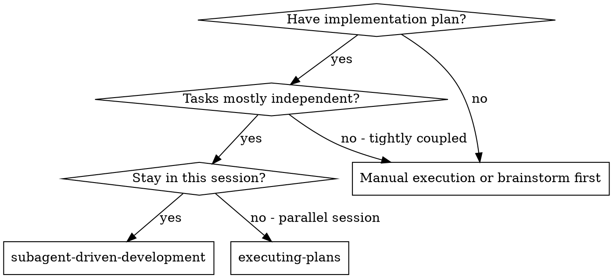
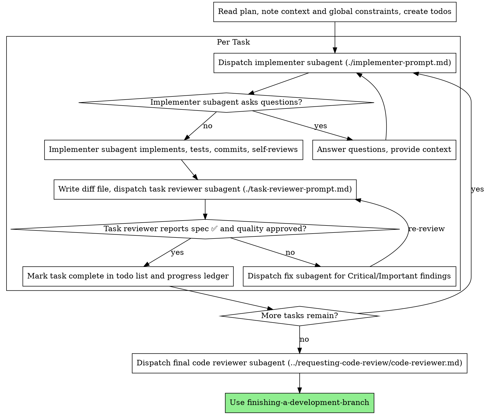

# Subagent-Driven Development

Execute plan by dispatching a fresh implementer subagent per task, a task review (spec compliance + code quality) after each, and a broad whole-branch review at the end.

**Why subagents:** You delegate tasks to specialized agents with isolated context. By precisely crafting their instructions and context, you ensure they stay focused and succeed at their task. They should never inherit your session's context or history — you construct exactly what they need. This also preserves your own context for coordination work.

**Core principle:** Fresh subagent per task + task review (spec + quality) + broad final review = high quality, fast iteration

**Narration:** between tool calls, narrate at most one short line — the
ledger and the tool results carry the record.

**Continuous execution:** Do not pause to check in with your human partner between tasks. Execute all tasks from the plan without stopping. The only reasons to stop are: BLOCKED status you cannot resolve, ambiguity that genuinely prevents progress, or all tasks complete. "Should I continue?" prompts and progress summaries waste their time — they asked you to execute the plan, so execute it.

## Prodige Integration

**Auto-Loaded By:** `/build` command workflow  
**Required For:** Orchestrator Agent  
**Used With:** Backend Agent, Frontend Agent, QA Agent  
**Enforcement:** Quality Gate - Fresh subagent + review per task

This skill integrates with Prodige's multi-agent architecture:
- **Orchestrator dispatches:** Backend Agent, Frontend Agent, QA Agent
- **File-based task briefs:** `.ai/runtime/briefs/task-N-brief.md`
- **Progress tracking:** `.ai/runtime/ledgers/progress.json`
- **Snapshot/session system:** Parallel mode support
- **Works WITH:** test-driven-development, verification-before-completion

**Prodige Workflow implements subagent-driven development as its core execution model.** This skill defines the generic workflow; Prodige provides the agent roles, runtime structure, snapshot system, and command-level integration that makes this pattern production-ready.

### Prodige Agent Roles

Prodige formalizes the "fresh subagent per task" model with specialized agent roles:

**Orchestrator Agent** (`.ai/agents/orchestrator.md`)
- **Responsibilities:** Owns the execution loop described in this skill. Reads implementation plans, creates task briefs, dispatches implementer agents, coordinates task reviews, manages the progress ledger, and triggers the final whole-branch review.
- **When it uses this skill:** When executing a `/build` command with a multi-task implementation plan. The Orchestrator is the "controller" role described throughout this skill.
- **Key behaviors:**
  - Reads plan files and extracts individual tasks
  - Creates task briefs using Prodige's brief generation system
  - Selects appropriate implementer agent (Backend, Frontend, QA) based on task domain
  - Dispatches the Reviewer agent for both task-level and final reviews
  - Maintains the progress ledger at `.ai/runtime/ledgers/progress.json`
  - Enforces engineering behavioral principles (simplicity first, surgical changes, no silent assumptions)
  - Automatically loads required skills from `.ai/skills/` based on command context

**Backend Agent** (`.ai/agents/backend.md`)
- **Responsibilities:** Implements backend tasks (APIs, services, database logic, server-side features)
- **Role in this skill:** Acts as the "implementer subagent" for backend tasks
- **Key behaviors:**
  - Follows TDD mandatorily (RED-GREEN-REFACTOR)
  - Surfaces assumptions before implementing (never guesses)
  - Chooses simplicity (functions before classes, direct queries before ORMs for simple cases)
  - Makes surgical changes only (no drive-by refactoring)
  - Provides verification evidence before claiming "done"
  - Self-reviews implementation before handoff
  - Reports status: DONE, DONE_WITH_CONCERNS, NEEDS_CONTEXT, or BLOCKED

**Frontend Agent** (`.ai/agents/frontend.md`)
- **Responsibilities:** Implements frontend tasks (UI components, state management, client-side features)
- **Role in this skill:** Acts as the "implementer subagent" for frontend tasks
- **Key behaviors:**
  - Follows TDD mandatorily (component tests, interaction tests)
  - Surfaces assumptions (clarifies design, behavior, responsive requirements)
  - Chooses simplicity (local state before Context, Context before Redux)
  - Makes surgical changes only (no refactoring unrelated components)
  - Provides verification evidence (tests + manual browser verification)
  - Self-reviews implementation before handoff
  - Reports status: DONE, DONE_WITH_CONCERNS, NEEDS_CONTEXT, or BLOCKED

**QA Agent** (`.ai/agents/qa.md`)
- **Responsibilities:** Implements test-focused tasks (test suites, edge case coverage, regression tests, acceptance validation)
- **Role in this skill:** Acts as the "implementer subagent" for testing tasks
- **Key behaviors:**
  - Clarifies acceptance criteria before writing tests
  - Tests behavior (not implementation details)
  - Focuses on critical paths + edge cases (not 100% code coverage for its own sake)
  - Uses Arrange-Act-Assert pattern
  - Makes surgical test additions (only for new/changed functionality)
  - Provides verification evidence (test results)
  - Reports status: DONE, DONE_WITH_CONCERNS, NEEDS_CONTEXT, or BLOCKED

**Reviewer Agent** (`.ai/agents/reviewer.md`)
- **Responsibilities:** Executes both task-level reviews (spec compliance + code quality) and final whole-branch reviews
- **Role in this skill:** Acts as the "task reviewer subagent" and "final code reviewer subagent"
- **Key behaviors:**
  - Enforces engineering principles: simplicity check, assumption clarity check, surgical precision check, scope creep check
  - Returns two verdicts for task reviews: **Spec Compliance** (✅ or ❌) and **Task Quality** (Approved or Issues with severity levels)
  - Uses severity levels: **Critical** (blocks task), **Important** (must fix before complete), **Minor** (accumulate for final review)
  - Flags "⚠️ Cannot verify from diff" items that require cross-task context
  - Provides specific, actionable feedback with code examples
  - For final whole-branch reviews: assesses merge readiness, checks for regressions, validates global constraints

**Relationship to this skill:** The Prodige agents **are** the roles described in this skill, with explicit behavioral contracts defined in their agent files. When this skill says "dispatch implementer subagent," the Orchestrator dispatches Backend, Frontend, or QA agent. When this skill says "dispatch task reviewer subagent," the Orchestrator dispatches the Reviewer agent.

### Prodige Runtime Structure

Prodige organizes the file handoffs and progress tracking this skill requires:

**Task Briefs** (`.ai/runtime/briefs/`)
- Location: `.ai/runtime/briefs/task-N-brief.md`
- Purpose: Single source of requirements for Task N
- Generated by: Orchestrator using task extraction from plan files
- Contains: Task description, acceptance criteria, exact values, interfaces, constraints
- Used by: Implementer agents read this first; Reviewer agent uses it to validate spec compliance
- Example:
  ```
  .ai/runtime/briefs/task-1-brief.md
  .ai/runtime/briefs/task-2-brief.md
  .ai/runtime/briefs/task-3-brief.md
  ```

**Task Reports** (`.ai/runtime/reports/`)
- Location: `.ai/runtime/reports/task-N-report.md`
- Purpose: Implementer's work summary, test results, self-review, concerns
- Generated by: Implementer agents write this before reporting DONE
- Contains: What was implemented, test commands run, test output, self-review findings, concerns (if any)
- Used by: Reviewer agent reads this to understand what was done; Orchestrator uses it for progress tracking
- Fix dispatches append to the same report file

**Review Packages** (`.ai/runtime/reviews/`)
- Location: `.ai/runtime/reviews/task-N-review-package.txt`
- Purpose: Complete diff context for reviewer (commit list, stat summary, full diff with context)
- Generated by: Orchestrator runs `scripts/review-package BASE HEAD` after implementer completes
- Contains: Git log, diffstat, unified diff with 10 lines of context
- Used by: Reviewer agent reads this as a single file instead of reconstructing diffs
- For final review: `.ai/runtime/reviews/final-review-package.txt` (MERGE_BASE to HEAD)

**Progress Ledger** (`.ai/runtime/ledgers/progress.json`)
- Location: `.ai/runtime/ledgers/progress.json`
- Purpose: Durable record of completed tasks (survives context compaction)
- Structure:
  ```json
  {
    "plan": "docs/plans/feature-x-plan.md",
    "branch": "feature/user-auth",
    "started": "2024-01-15T10:00:00Z",
    "tasks": [
      {
        "id": 1,
        "description": "Hook installation script",
        "status": "complete",
        "commits": "a1b2c3d..e4f5g6h",
        "review": "clean",
        "completed": "2024-01-15T10:30:00Z"
      },
      {
        "id": 2,
        "description": "Recovery modes",
        "status": "complete",
        "commits": "e4f5g6h..i7j8k9l",
        "review": "clean",
        "completed": "2024-01-15T11:15:00Z"
      },
      {
        "id": 3,
        "description": "Progress reporting",
        "status": "in-progress",
        "agent": "backend",
        "started": "2024-01-15T11:20:00Z"
      }
    ]
  }
  ```
- Updated by: Orchestrator after each task completes
- Recovery strategy: After context compaction, Orchestrator reads this ledger to resume at the correct task

**Review Reports** (`.ai/reports/reviews/`)
- Location: `.ai/reports/reviews/task-N-review.md` (task reviews), `.ai/reports/reviews/final-review.md` (whole-branch)
- Purpose: Reviewer's findings (spec compliance verdict, quality issues with severity, recommendations)
- Generated by: Reviewer agent writes this after analyzing the review package
- Contains:
  - Spec Compliance: ✅ (all requirements met, nothing extra) or ❌ (with details)
  - Quality Issues: Grouped by severity (Critical, Important, Minor)
  - Strengths: What was done well
  - Verdict: Task quality approved / must fix / BLOCKED
- Used by: Orchestrator reads this to determine next action (proceed, dispatch fixer, escalate)

### Integration with `/build` Command

Prodige's `/build` command (`.ai/commands/build.md`) is the entry point for subagent-driven development:

**Pre-Build:**
1. User runs `/build` with an approved plan
2. Orchestrator loads this skill automatically
3. Orchestrator loads required skills: `test-driven-development`, `verification-before-completion`, `repomap`, `ripgrep`
4. Orchestrator reads plan file and creates task list

**Execution Loop:**
1. Orchestrator extracts Task N to `.ai/runtime/briefs/task-N-brief.md`
2. Orchestrator records BASE commit (for review package generation)
3. Orchestrator dispatches implementer agent (Backend/Frontend/QA) with:
   - Path to task brief
   - Path to report file (`.ai/runtime/reports/task-N-report.md`)
   - Global constraints from plan
   - Interfaces from previous tasks
4. Implementer agent:
   - Reads brief
   - Asks clarifying questions if needed (Orchestrator answers)
   - Implements using TDD
   - Runs tests
   - Self-reviews
   - Writes report file
   - Returns status: DONE / DONE_WITH_CONCERNS / NEEDS_CONTEXT / BLOCKED
5. Orchestrator generates review package: `scripts/review-package BASE HEAD > .ai/runtime/reviews/task-N-review-package.txt`
6. Orchestrator dispatches Reviewer agent with:
   - Path to task brief
   - Path to task report
   - Path to review package
   - Global constraints from plan
7. Reviewer agent:
   - Reads brief, report, and review package
   - Checks spec compliance (all requirements met, nothing extra)
   - Checks code quality (simplicity, surgical changes, verification)
   - Writes review report to `.ai/reports/reviews/task-N-review.md`
   - Returns verdicts: Spec ✅/❌, Quality Approved/Issues
8. Orchestrator handles review outcome:
   - **Spec ✅ + Quality Approved:** Mark task complete in progress ledger, move to next task
   - **Spec ❌ or Critical/Important issues:** Dispatch fix subagent, re-review after fix
   - **Minor issues only:** Record in ledger, move to next task (triage in final review)
   - **⚠️ Cannot verify items:** Orchestrator resolves using cross-task context
9. Repeat until all tasks complete

**Post-Build:**
1. Orchestrator generates final review package: `scripts/review-package MERGE_BASE HEAD > .ai/runtime/reviews/final-review-package.txt`
2. Orchestrator dispatches Reviewer agent for whole-branch review
3. Reviewer checks: merge readiness, accumulated minor issues, regressions, global constraints
4. If final review returns issues: Orchestrator dispatches ONE fix subagent with complete findings list
5. Final review clean: Orchestrator triggers `/sync` (context update) and prepares handoff

### Prodige Snapshot System

Prodige uses a snapshot system to manage context and enable parallel execution:

**Snapshots:**
- **What:** Point-in-time copies of `.ai/context/` files (ARCHITECTURE.md, IMPLEMENTATION.md, CONTEXT.md, DECISIONS.md, CHANGELOG.md)
- **When created:** Before starting `/build`, before risky operations, before parallel task dispatch
- **Location:** `.ai/snapshots/snapshot-{timestamp}/`
- **Purpose:** Ensures implementer agents read stable context (not live-changing files), enables rollback, supports parallel execution without conflicts

**How subagent-driven development uses snapshots:**
1. Orchestrator creates snapshot before dispatching first task
2. All implementer agents read from snapshot (e.g., `.ai/snapshots/snapshot-20240115-100000/ARCHITECTURE.md`)
3. Implementer agents never write to context files (only code and tests)
4. After all tasks complete, Orchestrator updates live context if needed (via `/sync`)
5. This prevents race conditions and context corruption during parallel execution

**Session isolation:**
- Each `/build` execution gets a unique session ID
- Task briefs, reports, and review packages are namespaced by session
- Enables multiple developers (or parallel orchestrators) to work on different features simultaneously

### Behavioral Discipline Principles

Prodige enforces engineering behavioral principles at every stage, aligning with this skill's quality gates:

**Principle 1: Think Before Coding (Surface Assumptions)**
- Implementer agents MUST ask clarifying questions when requirements are ambiguous
- Template in agent files: present options, pros/cons, recommendations
- Orchestrator provides answers and records decisions

**Principle 2: Simplicity First**
- Implementer agents default to simple solutions (functions before classes, local state before global, direct queries before ORM)
- Reviewer agent enforces this: flags abstractions with single use, design patterns for trivial cases, speculative features
- Severity: Important (must simplify before task complete)

**Principle 3: Surgical Changes Only**
- Implementer agents edit only files related to task
- No drive-by refactoring, no style changes, no "while we're here" improvements
- Reviewer agent audits git diff: flags unrelated files, formatting changes, comment edits
- Severity: Important (must revert non-surgical changes)

**Principle 4: Goal-Driven Execution (Verifiable Success Criteria)**
- Task briefs contain concrete acceptance criteria
- Implementer agents define verification steps in their execution plan
- Implementer agents provide evidence in report file (test commands, output, coverage)
- Reviewer agent checks: "Can I verify this from the report?" If no, verdict = incomplete

**Integration:** These principles are baked into Prodige agent contracts. The Reviewer agent's checklist is literally the Engineering principle check. This skill's "Red Flags" section maps directly to Prodige's review severity levels.

### Prodige Checkpoint Integration

Prodige's checkpoint system (`.ai/commands/checkpoint.md`) integrates with this skill's recovery strategy:

**Automatic checkpoints:**
- Before starting `/build`: `checkpoint-pre-build-{feature-name}`
- After each task completes: `checkpoint-task-{N}-complete`
- Before final review: `checkpoint-pre-final-review`

**Manual checkpoints:**
- Developer runs `/checkpoint stable-state` anytime
- Creates git tag: `checkpoint-stable-state`

**Recovery scenario:**
- Context compaction occurs during Task 5
- Orchestrator loses memory of Tasks 1-4
- Orchestrator reads progress ledger: sees Tasks 1-4 complete
- Orchestrator runs `git log` to verify commits exist
- Orchestrator resumes at Task 5 (does NOT re-dispatch Tasks 1-4)

**Rollback scenario:**
- Task 3 review fails multiple times (BLOCKED)
- Orchestrator escalates to human
- Human reviews situation, decides to rollback to checkpoint before Task 3
- Human runs `/rollback checkpoint-task-2-complete`
- Orchestrator restarts from Task 3 with revised approach

### Example: Full `/build` Execution in Prodige

**Setup:**
- Plan file: `docs/plans/auth-feature-plan.md` (3 tasks)
- Command: `/build docs/plans/auth-feature-plan.md`
- Current branch: `feature/user-authentication`

**Execution:**

```
[Orchestrator activates subagent-driven-development skill]

1. Pre-flight:
   - Read auth-feature-plan.md
   - Extract 3 tasks:
     - Task 1: Add POST /auth/login endpoint
     - Task 2: Add auth middleware
     - Task 3: Add unit tests for auth flow
   - Create snapshot: .ai/snapshots/snapshot-20240115-100000/
   - Create progress ledger: .ai/runtime/ledgers/progress.json
   - Create checkpoint: checkpoint-pre-build-auth-feature

2. Task 1: Add POST /auth/login endpoint

   [Orchestrator]
   - Extracts Task 1 to .ai/runtime/briefs/task-1-brief.md
   - Records BASE commit: a1b2c3d
   - Dispatches Backend agent with:
     * Brief path: .ai/runtime/briefs/task-1-brief.md
     * Report path: .ai/runtime/reports/task-1-report.md
     * Global constraints: "Use JWT tokens, bcrypt for passwords"
     * Snapshot path: .ai/snapshots/snapshot-20240115-100000/

   [Backend agent]
   - Reads brief: "Add POST /auth/login endpoint accepting {email, password}, return JWT on success"
   - Clarifying question: "Should I use existing users table or create new?"
   - [Orchestrator answers: "Use existing users table"]
   - Implements using TDD:
     * RED: Writes test_login_endpoint.js (expects 200 + token)
     * Verifies RED: Test fails (endpoint doesn't exist)
     * GREEN: Implements routes/auth.js (login endpoint)
     * Verifies GREEN: Test passes
     * REFACTOR: Extracts token generation to utils/jwt.js
     * Verifies: Tests still green
   - Runs full test suite: 42/42 passing
   - Self-review: "Logic clear, covered with tests, no concerns"
   - Writes .ai/runtime/reports/task-1-report.md:
     ```
     Implemented: POST /auth/login endpoint
     Files: routes/auth.js, utils/jwt.js, tests/auth/login.test.js
     Tests: npm test -- login.test.js → 3/3 passing
     Regression: npm test → 45/45 passing (was 42)
     Self-review: No issues found
     ```
   - Returns: DONE (commits: a1b2c3d..e4f5g6h)

   [Orchestrator]
   - Generates review package:
     `scripts/review-package a1b2c3d e4f5g6h > .ai/runtime/reviews/task-1-review-package.txt`
   - Dispatches Reviewer agent with:
     * Brief: .ai/runtime/briefs/task-1-brief.md
     * Report: .ai/runtime/reports/task-1-report.md
     * Review package: .ai/runtime/reviews/task-1-review-package.txt
     * Global constraints: "Use JWT tokens, bcrypt for passwords"

   [Reviewer agent]
   - Reads brief, report, review package
   - Spec compliance check:
     * ✅ POST /auth/login endpoint exists
     * ✅ Accepts email, password
     * ✅ Returns JWT on success
     * ✅ Nothing extra (no password reset, no OAuth)
   - Quality check:
     * ✅ Simplicity: Functions, no unnecessary classes
     * ✅ Surgical: Only auth-related files changed
     * ✅ Verification: Test output provided, 45/45 passing
     * ✅ TDD followed: Test in diff before implementation
   - Writes .ai/reports/reviews/task-1-review.md:
     ```
     Spec Compliance: ✅ All requirements met, nothing extra
     Strengths: Clean implementation, good test coverage
     Issues: None
     Verdict: Task quality APPROVED
     ```
   - Returns: Spec ✅, Quality Approved

   [Orchestrator]
   - Updates progress ledger:
     ```json
     {"id": 1, "status": "complete", "commits": "a1b2c3d..e4f5g6h", "review": "clean"}
     ```
   - Creates checkpoint: checkpoint-task-1-complete

3. Task 2: Add auth middleware

   [Orchestrator]
   - Extracts Task 2 to .ai/runtime/briefs/task-2-brief.md
   - Records BASE commit: e4f5g6h
   - Dispatches Backend agent with brief, report path, snapshot

   [Backend agent]
   - Reads brief: "Add middleware to protect routes, verify JWT, attach user to req.user"
   - No questions (requirements clear)
   - Implements using TDD:
     * RED: Writes test_auth_middleware.js
     * GREEN: Implements middleware/auth.js
     * REFACTOR: Extracts JWT verification to utils/jwt.js
   - Adds extra feature: Rate limiting on auth endpoints (NOT in brief)
   - Writes report, returns: DONE (commits: e4f5g6h..i7j8k9l)

   [Orchestrator]
   - Generates review package
   - Dispatches Reviewer agent

   [Reviewer agent]
   - Spec compliance check:
     * ✅ Middleware protects routes
     * ✅ Verifies JWT
     * ✅ Attaches user to req.user
     * ❌ EXTRA: Rate limiting (not requested)
   - Writes review:
     ```
     Spec Compliance: ❌
     - Extra: Added rate limiting (not in brief, not in global constraints)
     
     Issues:
     - [Important] Scope creep: Remove rate limiting or get approval
     
     Verdict: Must fix
     ```
   - Returns: Spec ❌

   [Orchestrator]
   - Dispatches fix subagent (same Backend agent) with:
     * "Remove rate limiting (scope creep per reviewer)"
     * Append fix to .ai/runtime/reports/task-2-report.md

   [Backend agent fixer]
   - Removes rate limiting code
   - Re-runs tests: 48/48 passing
   - Appends to report:
     ```
     Fix applied: Removed rate limiting
     Tests: npm test → 48/48 passing
     ```
   - Returns: DONE (new commit: i7j8k9l..m1n2o3p)

   [Orchestrator]
   - Generates new review package (e4f5g6h..m1n2o3p)
   - Dispatches Reviewer agent for re-review

   [Reviewer agent]
   - Reads updated diff
   - Spec compliance: ✅ (rate limiting removed)
   - Quality: APPROVED
   - Returns: Spec ✅, Quality Approved

   [Orchestrator]
   - Updates progress ledger: Task 2 complete
   - Creates checkpoint: checkpoint-task-2-complete

4. Task 3: Add unit tests for auth flow

   [Orchestrator]
   - Dispatches QA agent (testing task)

   [QA agent]
   - Implements comprehensive test suite
   - Returns: DONE

   [Reviewer agent]
   - Spec ✅, Quality Approved

   [Orchestrator]
   - Updates ledger: Task 3 complete

5. Final Whole-Branch Review

   [Orchestrator]
   - All tasks complete
   - Generates final review package:
     `scripts/review-package main feature/user-authentication > .ai/runtime/reviews/final-review-package.txt`
   - Dispatches Reviewer agent for final review with:
     * All task briefs
     * Final review package
     * Global constraints
     * Accumulated minor issues (none in this case)

   [Reviewer agent]
   - Checks:
     * All requirements from plan met: ✅
     * No regressions (compared with main): ✅
     * Architectural consistency: ✅
     * Test coverage adequate: ✅
     * No accumulated minor issues: ✅
   - Writes .ai/reports/reviews/final-review.md:
     ```
     Final Review: Auth Feature
     
     Spec Compliance: ✅ All plan requirements met
     Quality: APPROVED
     Regressions: None detected
     Merge Readiness: APPROVED
     
     Recommendation: Ready to merge
     ```
   - Returns: APPROVED

   [Orchestrator]
   - Runs `/sync` to update live context (if needed)
   - Writes handoff: .ai/HANDOFF_FOR_NEXT_SESSION.md
   - Reports to human: "Auth feature build complete. 3/3 tasks done. Final review clean. Ready for PR."

[Build complete: 2 hours 15 minutes, 3 tasks, 1 review loop (Task 2 scope creep fixed)]
```

**Key Prodige patterns demonstrated:**
- Task briefs as single source of requirements
- Report files for implementer → reviewer handoff
- Review packages as files (not pasted diffs)
- Progress ledger for durable tracking
- Specialized agent roles (Backend for tasks 1-2, QA for task 3, Reviewer for all reviews)
- discipline enforcement (scope creep caught and fixed)
- Checkpoint creation for recovery
- Snapshot system (not shown in detail, but agents read from snapshot)

### Prodige vs. Generic Subagent-Driven Development

**What Prodige adds:**
- **Formal agent roles** with explicit behavioral contracts (Backend, Frontend, QA, Reviewer, Orchestrator)
- **Runtime structure** (`.ai/runtime/briefs/`, `.ai/runtime/reports/`, `.ai/runtime/reviews/`, `.ai/runtime/ledgers/`)
- **discipline enforcement** built into agent contracts and review checklists
- **Snapshot system** for context stability and parallel safety
- **Command integration** (`/build` as entry point, `/checkpoint` for recovery, `/sync` for context updates)
- **Skill auto-loading** (Orchestrator loads TDD, verification, repomap automatically)
- **Progress ledger format** (JSON with task status, commits, review outcomes)
- **Review report format** (Spec ✅/❌, Quality with severity levels, specific recommendations)

**What remains generic:**
- The core loop (dispatch → implement → review → fix → re-review → next task)
- The file-handoff principle (briefs, reports, review packages as files)
- The review criteria (spec compliance, code quality, surgical changes, verification)
- The status contract (DONE, DONE_WITH_CONCERNS, NEEDS_CONTEXT, BLOCKED)
- The recovery strategy (progress ledger + git log)

**Result:** Prodige makes this skill production-ready by providing the agent infrastructure, runtime conventions, and tooling that the generic skill describes but doesn't implement.

## Prodige Agent Roles

**Orchestrator (You):**
- Read IMPLEMENTATION.md plan
- Dispatch Backend/Frontend/QA agents per task
- Coordinate task briefs and review cycles
- Maintain progress ledger

**Backend Agent:**
- Implement server-side tasks
- API endpoints, database, business logic
- Follow TDD, commit with clear messages

**Frontend Agent:**
- Implement client-side tasks
- UI components, state management, styling
- Follow TDD, commit with clear messages

**QA Agent:**
- Implement testing tasks
- E2E tests, integration tests, test infrastructure
- Follow TDD, commit with clear messages

**Reviewer Agent:**
- Review each task for spec compliance + code quality
- Classify issues: Critical | Important | Minor
- Save reports to `.ai/reports/reviews/`

## When to Use



**vs. Executing Plans (parallel session):**
- Same session (no context switch)
- Fresh subagent per task (no context pollution)
- Review after each task (spec compliance + code quality), broad review at the end
- Faster iteration (no human-in-loop between tasks)

## The Process



## Pre-Flight Plan Review

Before dispatching Task 1, scan the plan once for conflicts:

- tasks that contradict each other or the plan's Global Constraints
- anything the plan explicitly mandates that the review rubric treats as a
  defect (a test that asserts nothing, verbatim duplication of a logic block)

Present everything you find to your human partner as one batched question —
each finding beside the plan text that mandates it, asking which governs —
before execution begins, not one interrupt per discovery mid-plan. If the
scan is clean, proceed without comment. The review loop remains the net for
conflicts that only emerge from implementation.

## Model Selection

Use the least powerful model that can handle each role to conserve cost and increase speed.

**Mechanical implementation tasks** (isolated functions, clear specs, 1-2 files): use a fast, cheap model. Most implementation tasks are mechanical when the plan is well-specified.

**Integration and judgment tasks** (multi-file coordination, pattern matching, debugging): use a standard model.

**Architecture and design tasks**: use the most capable available model.
The final whole-branch review is one of these — dispatch it on the most
capable available model, not the session default.

**Review tasks**: choose the model with the same judgment, scaled to the
diff's size, complexity, and risk. A small mechanical diff does not need the
most capable model; a subtle concurrency change does.

**Always specify the model explicitly when dispatching a subagent.** An
omitted model inherits your session's model — often the most capable and
most expensive — which silently defeats this section.

**Turn count beats token price.** Wall-clock and context cost scale with how
many turns a subagent takes, and the cheapest models routinely take 2-3× the
turns on multi-step work — costing more overall. Use a mid-tier model as the
floor for reviewers and for implementers working from prose descriptions.
When the task's plan text contains the complete code to write, the
implementation is transcription plus testing: use the cheapest tier for
that implementer. Single-file mechanical fixes also take the cheapest tier.

**Task complexity signals (implementation tasks):**
- Touches 1-2 files with a complete spec → cheap model
- Touches multiple files with integration concerns → standard model
- Requires design judgment or broad codebase understanding → most capable model

## Handling Implementer Status

Implementer subagents report one of four statuses. Handle each appropriately:

**DONE:** Generate the review package (`scripts/review-package BASE HEAD`, from this skill's directory — it prints the unique file path it wrote; BASE is the commit you recorded before dispatching the implementer — never `HEAD~1`, which silently drops all but the last commit of a multi-commit task), then dispatch the task reviewer with the printed path.

**DONE_WITH_CONCERNS:** The implementer completed the work but flagged doubts. Read the concerns before proceeding. If the concerns are about correctness or scope, address them before review. If they're observations (e.g., "this file is getting large"), note them and proceed to review.

**NEEDS_CONTEXT:** The implementer needs information that wasn't provided. Provide the missing context and re-dispatch.

**BLOCKED:** The implementer cannot complete the task. Assess the blocker:
1. If it's a context problem, provide more context and re-dispatch with the same model
2. If the task requires more reasoning, re-dispatch with a more capable model
3. If the task is too large, break it into smaller pieces
4. If the plan itself is wrong, escalate to the human

**Never** ignore an escalation or force the same model to retry without changes. If the implementer said it's stuck, something needs to change.

## Handling Reviewer ⚠️ Items

The task reviewer may report "⚠️ Cannot verify from diff" items — requirements
that live in unchanged code or span tasks. These do not block the rest of the
review, but you must resolve each one yourself before marking the task
complete: you hold the plan and cross-task context the reviewer
lacks. If you confirm an item is a real gap, treat it as a failed spec
review — send it back to the implementer and re-review.

## Constructing Reviewer Prompts

Per-task reviews are task-scoped gates. The broad review happens once, at the
final whole-branch review. When you fill a reviewer template:

- Do not add open-ended directives like "check all uses" or "run race tests
  if useful" without a concrete, task-specific reason
- Do not ask a reviewer to re-run tests the implementer already ran on the
  same code — the implementer's report carries the test evidence
- Do not pre-judge findings for the reviewer — never instruct a reviewer to
  ignore or not flag a specific issue. If you believe a finding would be a
  false positive, let the reviewer raise it and adjudicate it in the review
  loop. If the prompt you are writing contains "do not flag," "don't treat X
  as a defect," "at most Minor," or "the plan chose" — stop: you are
  pre-judging, usually to spare yourself a review loop.
- The global-constraints block you hand the reviewer is its attention
  lens. Copy the binding requirements verbatim from the plan's Global
  Constraints section or the spec: exact values, exact formats, and the
  stated relationships between components ("same layout as X", "matches
  Y"). The reviewer's template already carries the process rules (YAGNI,
  test hygiene, review method) — the constraints block is for what THIS
  project's spec demands.
- Hand the reviewer its diff as a file: run this skill's
  `scripts/review-package BASE HEAD` and pass the reviewer the file path
  it prints (or, without bash: `git log --oneline`, `git diff --stat`,
  and `git diff -U10` for the range, redirected to one uniquely named
  file). The output never enters your own context, and the reviewer sees
  the commit list, stat summary, and full diff with context in one Read
  call. Use the BASE you recorded before dispatching the implementer —
  never `HEAD~1`, which silently truncates multi-commit tasks.
- A dispatch prompt describes one task, not the session's history. Do not
  paste accumulated prior-task summaries ("state after Tasks 1-3") into
  later dispatches — a real session's dispatch hit 42k chars of which 99%
  was pasted history. A fresh subagent needs its task, the interfaces it
  touches, and the global constraints. Nothing else.
- Dispatch fix subagents for Critical and Important findings. Record Minor
  findings in the progress ledger as you go, and point the final
  whole-branch review at that list so it can triage which must be fixed
  before merge. A roll-up nobody reads is a silent discard.
- A finding labeled plan-mandated — or any finding that conflicts with
  what the plan's text requires — is the human's decision, like any plan
  contradiction: present the finding and the plan text, ask which governs.
  Do not dismiss the finding because the plan mandates it, and do not
  dispatch a fix that contradicts the plan without asking.
- The final whole-branch review gets a package too: run
  `scripts/review-package MERGE_BASE HEAD` (MERGE_BASE = the commit the
  branch started from, e.g. `git merge-base main HEAD`) and include the
  printed path in the final review dispatch, so the final reviewer reads
  one file instead of re-deriving the branch diff with git commands.
- Every fix dispatch carries the implementer contract: the fix subagent
  re-runs the tests covering its change and reports the results. Name the
  covering test files in the dispatch — a one-line fix does not need the
  whole suite. Before re-dispatching the reviewer, confirm the fix report
  contains the covering tests, the command run, and the output; dispatch
  the re-review once all three are present.
- If the final whole-branch review returns findings, dispatch ONE fix
  subagent with the complete findings list — not one fixer per finding.
  Per-finding fixers each rebuild context and re-run suites; a real
  session's final-review fix wave cost more than all its tasks combined.

## File Handoffs

Everything you paste into a dispatch prompt — and everything a subagent
prints back — stays resident in your context for the rest of the session
and is re-read on every later turn. Hand artifacts over as files:

- **Task brief:** before dispatching an implementer, run this skill's
  `scripts/task-brief PLAN_FILE N` — it extracts the task's full text to a
  uniquely named file and prints the path. Compose the dispatch so the
  brief stays the single source of requirements. Your dispatch should
  contain: (1) one line on where this task fits in the project; (2) the
  brief path, introduced as "read this first — it is your requirements,
  with the exact values to use verbatim"; (3) interfaces and decisions
  from earlier tasks that the brief cannot know; (4) your resolution of
  any ambiguity you noticed in the brief; (5) the report-file path and
  report contract. Exact values (numbers, magic strings, signatures, test
  cases) appear only in the brief.
- **Report file:** name the implementer's report file after the brief
  (brief `…/task-N-brief.md` → report `…/task-N-report.md`) and put it in
  the dispatch prompt. The implementer writes the full report there and
  returns only status, commits, a one-line test summary, and concerns.
- **Reviewer inputs:** the task reviewer gets three paths — the same brief
  file, the report file, and the review package — plus the global
  constraints that bind the task.
- Fix dispatches append their fix report (with test results) to the same
  report file and return a short summary; re-reviews read the updated file.

## Prodige File Locations

**Task Briefs:** `.ai/runtime/briefs/task-{N}-brief.md`  
**Progress Ledger:** `.ai/runtime/ledgers/progress.json`  
**Task Reports:** `.ai/runtime/reports/task-{N}-report.md`  
**Review Reports:** `.ai/reports/reviews/task-{N}-review.md`  
**Implementation Plan:** `.ai/context/IMPLEMENTATION.md`  
**Architecture:** `.ai/context/ARCHITECTURE.md`  
**PRD:** `.ai/context/PRD.md`

## Durable Progress

Conversation memory does not survive compaction. In real sessions,
controllers that lost their place have re-dispatched entire completed task
sequences — the single most expensive failure observed. Track progress in
a ledger file, not only in todos.

- At skill start, check for a ledger:
  `cat "$(git rev-parse --git-path sdd)/progress.md"`. Tasks listed there
  as complete are DONE — do not re-dispatch them; resume at the first task
  not marked complete.
- When a task's review comes back clean, append one line to the ledger in
  the same message as your other bookkeeping:
  `Task N: complete (commits <base7>..<head7>, review clean)`.
- The ledger is your recovery map: the commits it names exist in git even
  when your context no longer remembers creating them. After compaction,
  trust the ledger and `git log` over your own recollection.

## Prompt Templates

- [implementer-prompt.md](implementer-prompt.md) - Dispatch implementer subagent
- [task-reviewer-prompt.md](task-reviewer-prompt.md) - Dispatch task reviewer subagent (spec compliance + code quality)
- Final whole-branch review: use requesting-code-review's [code-reviewer.md](../requesting-code-review/code-reviewer.md)

## Prodige Workflow Example

**Scenario:** Orchestrator executing 3-task feature implementation

### Setup
```bash
# Orchestrator reads plan
Read: .ai/context/IMPLEMENTATION.md

# Plan has 3 tasks:
# Task 1: Implement POST /api/users endpoint (Backend)
# Task 2: Add UserForm component (Frontend)
# Task 3: Add E2E test for user creation (QA)

# Initialize progress ledger
mkdir -p .ai/runtime/ledgers
echo '{"tasks": []}' > .ai/runtime/ledgers/progress.json
```

### Task 1: Backend Work
```markdown
Orchestrator:
  Create: .ai/runtime/briefs/task-001-brief.md
  
  Dispatch Backend Agent:
    Brief: .ai/runtime/briefs/task-001-brief.md
    Report: .ai/runtime/reports/task-001-report.md
    Context: .ai/context/ARCHITECTURE.md, .ai/context/PRD.md
    
Backend Agent:
  Read brief → Ask clarification (if needed) → Implement with TDD → Self-review → Commit
  
  Returns:
    Status: DONE
    Commits: abc123, def456
    Tests: 12/12 passing
    Report: .ai/runtime/reports/task-001-report.md
    
Orchestrator:
  Generate review package: git diff {BASE}..{HEAD}
  
  Dispatch Reviewer Agent:
    Brief: .ai/runtime/briefs/task-001-brief.md
    Report: .ai/runtime/reports/task-001-report.md
    Diff: {review-package}
    Save To: .ai/reports/reviews/task-001-review.md
    
Reviewer Agent:
  Spec compliance: ✅
  Code quality: ✅ Approved
  Issues: None
  
Orchestrator:
  Update ledger:
    {"task": 1, "status": "complete", "commits": "abc123..def456", "review": "clean"}
  
  Continue to Task 2
```

### Task 2: Frontend Work
```markdown
[Same pattern with Frontend Agent]
```

### Task 3: QA Work
```markdown
[Same pattern with QA Agent]
```

### Final Review
```markdown
Orchestrator:
  All tasks complete
  
  Generate full branch diff: git diff {MERGE_BASE}..HEAD
  
  Dispatch Final Reviewer:
    Type: Pre-Merge Review
    Diff: Full branch
    Save To: .ai/reports/reviews/pre-merge-feature-users.md
    
Final Reviewer:
  Overall: ✅ APPROVED
  Merge recommendation: Safe to merge
  
Orchestrator:
  Feature complete
  Ready for /release workflow
```

## Advantages

**vs. Manual execution:**
- Subagents follow TDD naturally
- Fresh context per task (no confusion)
- Parallel-safe (subagents don't interfere)
- Subagent can ask questions (before AND during work)

**vs. Executing Plans:**
- Same session (no handoff)
- Continuous progress (no waiting)
- Review checkpoints automatic

**Efficiency gains:**
- Controller curates exactly what context is needed; bulk artifacts move
  as files, not pasted text
- Subagent gets complete information upfront
- Questions surfaced before work begins (not after)

**Quality gates:**
- Self-review catches issues before handoff
- Task review carries two verdicts: spec compliance and code quality
- Review loops ensure fixes actually work
- Spec compliance prevents over/under-building
- Code quality ensures implementation is well-built

**Cost:**
- More subagent invocations (implementer + reviewer per task)
- Controller does more prep work (extracting all tasks upfront)
- Review loops add iterations
- But catches issues early (cheaper than debugging later)

## Red Flags

**Never:**
- Start implementation on main/master branch without explicit user consent
- Skip task review, or accept a report missing either verdict (spec compliance AND task quality are both required)
- Proceed with unfixed issues
- Dispatch multiple implementation subagents in parallel (conflicts)
- Make a subagent read the whole plan file (hand it its task brief —
  `scripts/task-brief` — instead)
- Skip scene-setting context (subagent needs to understand where task fits)
- Ignore subagent questions (answer before letting them proceed)
- Accept "close enough" on spec compliance (reviewer found spec issues = not done)
- Skip review loops (reviewer found issues = implementer fixes = review again)
- Let implementer self-review replace actual review (both are needed)
- Tell a reviewer what not to flag, or pre-rate a finding's severity in the
  dispatch prompt ("treat it as Minor at most") — the plan's example code is
  a starting point, not evidence that its weaknesses were chosen
- Dispatch a task reviewer without a diff file — generate it first
  (`scripts/review-package BASE HEAD`) and name the printed path in the
  prompt
- Move to next task while the review has open Critical/Important issues
- Re-dispatch a task the progress ledger already marks complete — check
  the ledger (and `git log`) after any compaction or resume

**If subagent asks questions:**
- Answer clearly and completely
- Provide additional context if needed
- Don't rush them into implementation

**If reviewer finds issues:**
- Implementer (same subagent) fixes them
- Reviewer reviews again
- Repeat until approved
- Don't skip the re-review

**If subagent fails task:**
- Dispatch fix subagent with specific instructions
- Don't try to fix manually (context pollution)

## Integration

**Required workflow skills:**
- **using-git-worktrees** - Ensures isolated workspace (creates one or verifies existing)
- **implementation-planning** - Creates the plan this skill executes
- **requesting-code-review** - Code review template for the final whole-branch review
- **finishing-a-development-branch** - Complete development after all tasks

**Subagents should use:**
- **test-driven-development** - Subagents follow TDD for each task

**Alternative workflow:**
- **executing-plans** - Use for parallel session instead of same-session execution
