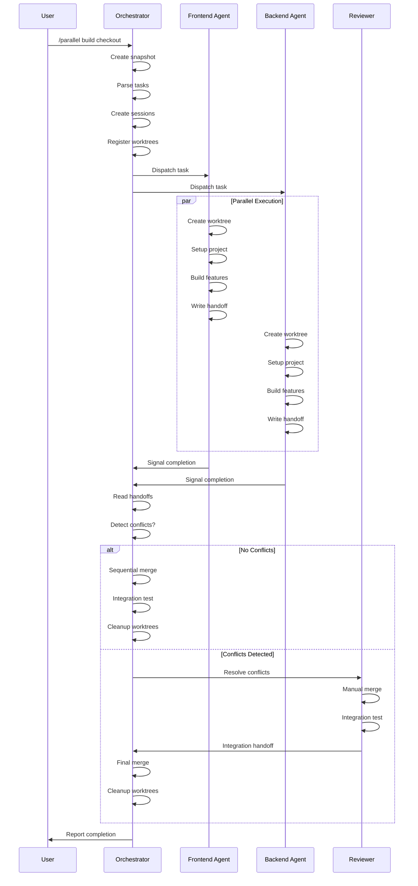

# Using Git Worktrees for Prodige

## Prodige Integration

**Auto-Loaded By:** `/parallel` command workflow  
**Required For:** Orchestrator Agent (parallel execution mode)  
**Worktree Locations:** `.ai/runtime/worktrees/{agent-name}/`  
**Session Management:** `.ai/runtime/sessions/`

This skill is used in two scenarios:

**1. Single-Agent Feature Work:**
- Isolate feature branch from main workspace
- Standard worktree setup for sequential development

**2. Parallel Multi-Agent Work (`/parallel` command):**
- One worktree per agent (Backend, Frontend, QA)
- Isolated workspaces prevent file conflicts
- Coordinated by Orchestrator with snapshot system

**Prodige Worktree Structure:**
```
.ai/runtime/worktrees/
├── backend-agent/     ← Backend Agent workspace
├── frontend-agent/    ← Frontend Agent workspace
└── qa-agent/          ← QA Agent workspace
```

Each worktree:
- Has own git branch (`parallel/backend-agent`, `parallel/frontend-agent`, etc.)
- Isolated from others (no file conflicts)
- Auto-setup (npm install, cargo build, etc.)
- Merged back by Orchestrator after review

## Overview

Ensure work happens in an isolated workspace. Prefer your platform's native worktree tools. Fall back to manual git worktrees only when no native tool is available.

**Core principle:** Detect existing isolation first. Then use native tools. Then fall back to git. Never fight the harness.

**Announce at start:** "I'm using the using-git-worktrees skill to set up an isolated workspace."

## Prodige Parallel Mode

When Orchestrator invokes `/parallel` command, this skill:

**Step A: Orchestrator Creates Snapshot**
- Freeze current repo state
- Record baseline: `.ai/runtime/snapshots/snapshot-{timestamp}/`

**Step B: Orchestrator Creates Worktrees**
- For each agent (Backend, Frontend, QA):
  - Create worktree at `.ai/runtime/worktrees/{agent-name}/`
  - Branch: `parallel/{agent-name}`
  - From snapshot commit

**Step C: Orchestrator Assigns Sessions**
- Create session config: `.ai/runtime/sessions/session-{agent}-{timestamp}.json`
- Contains: task brief, file locks, assigned files

**Step D: Agents Work Independently**
- Each agent in own worktree
- No interference between agents
- Commit to own branch

**Step E: Orchestrator Merges Results**
- After all agents complete
- Reviewer checks for conflicts
- Merge branches back to main

**Example Parallel Workflow:**
```bash
# Orchestrator setup
mkdir -p .ai/runtime/worktrees
git worktree add .ai/runtime/worktrees/backend-agent -b parallel/backend-agent HEAD
git worktree add .ai/runtime/worktrees/frontend-agent -b parallel/frontend-agent HEAD
git worktree add .ai/runtime/worktrees/qa-agent -b parallel/qa-agent HEAD

# Each agent works in isolation
cd .ai/runtime/worktrees/backend-agent
[Backend Agent implements Task 1]

cd .ai/runtime/worktrees/frontend-agent  
[Frontend Agent implements Task 2]

cd .ai/runtime/worktrees/qa-agent
[QA Agent implements Task 3]

# Orchestrator merges
git checkout main
git merge parallel/backend-agent
git merge parallel/frontend-agent
git merge parallel/qa-agent
```

## Step 0: Detect Existing Isolation

**Before creating anything, check if you are already in an isolated workspace.**

```bash
GIT_DIR=$(cd "$(git rev-parse --git-dir)" 2>/dev/null && pwd -P)
GIT_COMMON=$(cd "$(git rev-parse --git-common-dir)" 2>/dev/null && pwd -P)
BRANCH=$(git branch --show-current)
```

**Submodule guard:** `GIT_DIR != GIT_COMMON` is also true inside git submodules. Before concluding "already in a worktree," verify you are not in a submodule:

```bash
# If this returns a path, you're in a submodule, not a worktree — treat as normal repo
git rev-parse --show-superproject-working-tree 2>/dev/null
```

**If `GIT_DIR != GIT_COMMON` (and not a submodule):** You are already in a linked worktree. Skip to Step 2 (Project Setup). Do NOT create another worktree.

Report with branch state:
- On a branch: "Already in isolated workspace at `<path>` on branch `<name>`."
- Detached HEAD: "Already in isolated workspace at `<path>` (detached HEAD, externally managed). Branch creation needed at finish time."

**If `GIT_DIR == GIT_COMMON` (or in a submodule):** You are in a normal repo checkout.

Has the user already indicated their worktree preference in your instructions? If not, ask for consent before creating a worktree:

> "Would you like me to set up an isolated worktree? It protects your current branch from changes."

Honor any existing declared preference without asking. If the user declines consent, work in place and skip to Step 2.

## Step 1: Create Isolated Workspace

**You have two mechanisms. Try them in this order.**

### 1a. Native Worktree Tools (preferred)

The user has asked for an isolated workspace (Step 0 consent). Do you already have a way to create a worktree? It might be a tool with a name like `EnterWorktree`, `WorktreeCreate`, a `/worktree` command, or a `--worktree` flag. If you do, use it and skip to Step 2.

Native tools handle directory placement, branch creation, and cleanup automatically. Using `git worktree add` when you have a native tool creates phantom state your harness can't see or manage.

Only proceed to Step 1b if you have no native worktree tool available.

### 1b. Git Worktree Fallback

**Only use this if Step 1a does not apply** — you have no native worktree tool available. Create a worktree manually using git.

#### Directory Selection

Follow this priority order. Explicit user preference always beats observed filesystem state.

1. **Check your instructions for a declared worktree directory preference.** If the user has already specified one, use it without asking.

2. **Check for an existing project-local worktree directory:**
   ```bash
   ls -d .worktrees 2>/dev/null     # Preferred (hidden)
   ls -d worktrees 2>/dev/null      # Alternative
   ```
   If found, use it. If both exist, `.worktrees` wins.

3. **If there is no other guidance available**, default to `.worktrees/` at the project root.

#### Safety Verification (project-local directories only)

**MUST verify directory is ignored before creating worktree:**

```bash
git check-ignore -q .worktrees 2>/dev/null || git check-ignore -q worktrees 2>/dev/null
```

**If NOT ignored:** Add to .gitignore, commit the change, then proceed.

**Why critical:** Prevents accidentally committing worktree contents to repository.

#### Create the Worktree

**Prodige Parallel Execution:**

When used by `/parallel` command, directory location is predetermined:
- Location: `.ai/runtime/worktrees/{agent-name}/`
- No user choice, no safety verification needed (Orchestrator manages)
- Skip Steps 1b "Directory Selection" and "Safety Verification"
- Go directly to "Create the Worktree" with predetermined path

```bash
# Determine path based on chosen location
path="$LOCATION/$BRANCH_NAME"

git worktree add "$path" -b "$BRANCH_NAME"
cd "$path"
```

**Sandbox fallback:** If `git worktree add` fails with a permission error (sandbox denial), tell the user the sandbox blocked worktree creation and you're working in the current directory instead. Then run setup and baseline tests in place.

## Step 2: Project Setup

Auto-detect and run appropriate setup:

```bash
# Node.js
if [ -f package.json ]; then npm install; fi

# Rust
if [ -f Cargo.toml ]; then cargo build; fi

# Python
if [ -f requirements.txt ]; then pip install -r requirements.txt; fi
if [ -f pyproject.toml ]; then poetry install; fi

# Go
if [ -f go.mod ]; then go mod download; fi
```

## Step 3: Verify Clean Baseline

Run tests to ensure workspace starts clean:

```bash
# Use project-appropriate command
npm test / cargo test / pytest / go test ./...
```

**If tests fail:** Report failures, ask whether to proceed or investigate.

**If tests pass:** Report ready.

### Report

```
Worktree ready at <full-path>
Tests passing (<N> tests, 0 failures)
Ready to implement <feature-name>
```

## Quick Reference

| Situation | Action |
|-----------|--------|
| Already in linked worktree | Skip creation (Step 0) |
| In a submodule | Treat as normal repo (Step 0 guard) |
| Native worktree tool available | Use it (Step 1a) |
| No native tool | Git worktree fallback (Step 1b) |
| `.worktrees/` exists | Use it (verify ignored) |
| `worktrees/` exists | Use it (verify ignored) |
| Both exist | Use `.worktrees/` |
| Neither exists | Check instruction file, then default `.worktrees/` |
| Directory not ignored | Add to .gitignore + commit |
| Permission error on create | Sandbox fallback, work in place |
| Tests fail during baseline | Report failures + ask |
| No package.json/Cargo.toml | Skip dependency install |

## Common Mistakes

### Fighting the harness

- **Problem:** Using `git worktree add` when the platform already provides isolation
- **Fix:** Step 0 detects existing isolation. Step 1a defers to native tools.

### Skipping detection

- **Problem:** Creating a nested worktree inside an existing one
- **Fix:** Always run Step 0 before creating anything

### Skipping ignore verification

- **Problem:** Worktree contents get tracked, pollute git status
- **Fix:** Always use `git check-ignore` before creating project-local worktree

### Assuming directory location

- **Problem:** Creates inconsistency, violates project conventions
- **Fix:** Follow priority: explicit instructions > existing project-local directory > default

### Proceeding with failing tests

- **Problem:** Can't distinguish new bugs from pre-existing issues
- **Fix:** Report failures, get explicit permission to proceed

## Red Flags

**Never:**
- Create a worktree when Step 0 detects existing isolation
- Use `git worktree add` when you have a native worktree tool (e.g., `EnterWorktree`). This is the #1 mistake — if you have it, use it.
- Skip Step 1a by jumping straight to Step 1b's git commands
- Create worktree without verifying it's ignored (project-local)
- Skip baseline test verification
- Proceed with failing tests without asking

**Always:**
- Run Step 0 detection first
- Prefer native tools over git fallback
- Follow directory priority: explicit instructions > existing project-local directory > default
- Verify directory is ignored for project-local
- Auto-detect and run project setup
- Verify clean test baseline


---

# PRODIGE INTEGRATION

This section extends the core git worktree workflow with Prodige-specific features: the `/parallel` command, orchestrator coordination, standardized worktree paths, and snapshot system integration.

## Prodige Worktree Architecture

Prodige extends standard git worktrees with a structured runtime system designed for multi-agent parallel development. This architecture ensures agents work in isolated environments without conflicts while maintaining coordination through the orchestrator.

### Core Components

**1. Standardized Path Structure**

Prodige uses a consistent directory hierarchy for all runtime artifacts:

```
.ai/runtime/
├── worktrees/           # Isolated agent workspaces
│   ├── frontend/        # Agent-specific worktree
│   ├── backend/         # Agent-specific worktree
│   └── docs/            # Agent-specific worktree
├── sessions/            # Session metadata and state
│   ├── session-001.json
│   └── session-002.json
├── handoffs/            # Agent completion reports
│   ├── frontend-handoff.md
│   └── backend-handoff.md
├── locks/               # Coordination locks for shared resources
│   └── database-schema.lock
└── ledgers/             # Progress tracking
    └── progress.json
```

**2. Worktree Provenance Tracking**

Every Prodige-managed worktree is tracked in `.ai/runtime/worktrees.json`:

```json
{
  "worktrees": [
    {
      "path": ".ai/runtime/worktrees/frontend",
      "agent": "frontend",
      "branch": "feature/new-dashboard",
      "created": "2025-01-15T10:30:00Z",
      "session": "session-001",
      "status": "active",
      "snapshot": "checkpoint-pre-parallel"
    },
    {
      "path": ".ai/runtime/worktrees/backend",
      "agent": "backend",
      "branch": "feature/new-api",
      "created": "2025-01-15T10:30:00Z",
      "session": "session-001",
      "status": "active",
      "snapshot": "checkpoint-pre-parallel"
    }
  ]
}
```

**3. Integration with Git Worktrees**

Prodige's `.ai/runtime/worktrees/` paths are git worktrees under the hood:

```bash
# Standard git worktree list shows Prodige worktrees
git worktree list

# Output:
# /project/path              abc123 [main]
# /project/.ai/runtime/worktrees/frontend  def456 [feature/new-dashboard]
# /project/.ai/runtime/worktrees/backend   789xyz [feature/new-api]
```

The orchestrator manages these worktrees through git's native commands while maintaining additional metadata for coordination.

### Benefits of Prodige's Approach

1. **Isolation**: Each agent works in a separate filesystem branch
2. **Coordination**: Orchestrator tracks all active worktrees
3. **Safety**: Snapshot system enables rollback of parallel operations
4. **Provenance**: Complete audit trail of who created what and when
5. **Integration**: Compatible with existing git workflows

## Prodige Worktree Paths

Prodige enforces a standardized worktree location to enable orchestrator coordination and prevent conflicts with user workspace.

### Path Rules

**Primary Worktree Location:** `.ai/runtime/worktrees/<agent-name>/`

This path is:
- **Always ignored by git** (via `.ai/.gitignore`)
- **Automatically cleaned up** after merge
- **Tracked in provenance file** (`.ai/runtime/worktrees.json`)
- **Isolated from main workspace** (no accidental edits)

### Path Selection Logic (Prodige Mode)

When operating under Prodige orchestration:

```bash
# Step 1: Check if running in parallel mode
if [ -f .ai/runtime/sessions/current-session.json ]; then
  # Parse session to get assigned agent name
  AGENT_NAME=$(jq -r '.agent' .ai/runtime/sessions/current-session.json)
  
  # Step 2: Use Prodige standard path
  WORKTREE_PATH=".ai/runtime/worktrees/$AGENT_NAME"
  
  # Step 3: Verify path is tracked
  # Orchestrator should have already registered this in worktrees.json
  if ! grep -q "$WORKTREE_PATH" .ai/runtime/worktrees.json; then
    echo "ERROR: Worktree not registered by orchestrator"
    exit 1
  fi
  
  # Step 4: Create worktree at standard location
  git worktree add "$WORKTREE_PATH" -b "$BRANCH_NAME"
else
  # Not in parallel mode - fall back to standard detection logic
  # (Steps from main skill document)
fi
```

### Automatic Ignore Configuration

Prodige's `.ai/.gitignore` includes:

```gitignore
# Runtime artifacts (never commit)
runtime/
!runtime/.gitkeep

# This covers:
# - runtime/worktrees/
# - runtime/sessions/
# - runtime/handoffs/
# - runtime/locks/
# - runtime/ledgers/
```

No manual `.gitignore` updates needed - orchestrator handles this during `/init`.

### Directory Structure Example

```
my-project/
├── .git/                          # Main git directory
├── .ai/
│   ├── runtime/
│   │   └── worktrees/
│   │       ├── frontend/          # Frontend agent workspace
│   │       │   ├── src/
│   │       │   ├── tests/
│   │       │   └── package.json
│   │       ├── backend/           # Backend agent workspace
│   │       │   ├── src/
│   │       │   ├── tests/
│   │       │   └── Cargo.toml
│   │       └── docs/              # Docs agent workspace
│   │           └── README.md
│   └── .gitignore                 # Ignores runtime/
├── src/                           # Main workspace (unchanged)
└── tests/                         # Main workspace (unchanged)
```

### Path Verification Checklist

Before creating a Prodige worktree:

- [ ] Verify `.ai/runtime/` exists
- [ ] Verify `.ai/runtime/worktrees/` directory exists
- [ ] Verify `.ai/.gitignore` includes `runtime/`
- [ ] Verify current session assigns this agent name
- [ ] Verify path is registered in `worktrees.json`

If any check fails: **Do not proceed.** Report to orchestrator for configuration.


## /parallel Command Integration

The `/parallel` command orchestrates multiple agents working simultaneously in isolated worktrees. This section details the complete workflow from command invocation to merge completion.

### Command Syntax

```bash
/parallel <operation> <target>

# Examples:
/parallel build checkout      # Build multiple components in parallel
/parallel merge checkout      # Review and merge parallel work
/parallel resolve checkout    # Resolve conflicts from parallel merge
```

### Operations

**1. Build Checkout** - Set up parallel development environment

Creates worktrees, assigns agents, establishes coordination mechanisms.

**2. Merge Checkout** - Integrate parallel work

Reviews agent handoffs, merges changes, resolves conflicts.

**3. Resolve Checkout** - Fix merge conflicts

Coordinates conflict resolution when merges fail.

### The /parallel Build Workflow

This is the most common operation - setting up multiple agents to work in parallel on independent tasks.

#### Phase 1: Orchestrator Preparation

When you invoke `/parallel build checkout`, the orchestrator performs these steps:

**Step 1: Create Snapshot**

```bash
# Orchestrator creates named checkpoint
/checkpoint pre-parallel-$(date +%s)

# Records in .ai/runtime/snapshots.json
{
  "snapshots": [
    {
      "name": "pre-parallel-1705320600",
      "commit": "abc123def456",
      "timestamp": "2025-01-15T10:30:00Z",
      "reason": "Before parallel build operation",
      "worktrees": []
    }
  ]
}
```

**Why this matters:** If parallel operation fails catastrophically, orchestrator can roll back entire operation with `/rollback pre-parallel-1705320600`.

**Step 2: Parse Task Breakdown**

Orchestrator analyzes the user's request and identifies independent work domains:

```
User: "Build a new dashboard with authentication"

Orchestrator identifies:
- Frontend: Dashboard UI components
- Backend: Authentication API endpoints  
- Docs: API documentation and user guide
```

**Step 3: Create Sessions**

Orchestrator creates session metadata for each agent:

```json
// .ai/runtime/sessions/session-001.json
{
  "sessionId": "session-001",
  "agent": "frontend",
  "task": "Build dashboard UI components",
  "worktreePath": ".ai/runtime/worktrees/frontend",
  "branch": "feature/dashboard-ui",
  "created": "2025-01-15T10:30:00Z",
  "snapshot": "pre-parallel-1705320600",
  "status": "active",
  "locks": [],
  "dependencies": []
}
```

Similar sessions created for `backend` and `docs` agents.

**Step 4: Register Worktrees**

Orchestrator updates `.ai/runtime/worktrees.json`:

```json
{
  "worktrees": [
    {
      "path": ".ai/runtime/worktrees/frontend",
      "agent": "frontend",
      "branch": "feature/dashboard-ui",
      "session": "session-001",
      "status": "pending"
    }
    // ... backend and docs entries
  ]
}
```

**Step 5: Create Coordination Locks**

If agents might touch shared resources, orchestrator creates locks:

```json
// .ai/runtime/locks/database-schema.lock
{
  "resource": "database-schema",
  "owner": "backend",
  "session": "session-002",
  "created": "2025-01-15T10:30:00Z",
  "readers": ["docs"],
  "reason": "Backend modifying schema, docs documenting it"
}
```

**Step 6: Dispatch Agents**

Orchestrator invokes specialized agents with precise instructions:

```markdown
Agent: frontend
Session: session-001
Worktree: .ai/runtime/worktrees/frontend
Branch: feature/dashboard-ui

Task:
Build the dashboard UI components:
1. Dashboard layout component
2. Widget grid system
3. Data visualization charts
4. Responsive design

Constraints:
- Use existing design system from src/components/
- Follow React patterns established in codebase
- Write tests for all components
- Do NOT modify authentication logic (backend owns this)

Setup Instructions:
1. Read your session file: .ai/runtime/sessions/session-001.json
2. Verify worktree path: .ai/runtime/worktrees/frontend
3. Create worktree if not exists (use this skill)
4. Run project setup: npm install
5. Verify baseline: npm test

Completion Requirements:
- All tests passing
- Components integrated with existing app
- Write handoff: .ai/runtime/handoffs/frontend-handoff.md

Handoff Format:
- What you built
- What files changed
- What still needs work
- Integration notes
```

Similar detailed instructions dispatched to `backend` and `docs` agents.

#### Phase 2: Agent Execution (Parallel)

Each agent now operates independently:

**Agent Workflow:**

1. **Read Session**
   ```bash
   cat .ai/runtime/sessions/session-001.json
   # Confirms: agent name, task, worktree path, constraints
   ```

2. **Invoke This Skill**
   ```bash
   # Agent detects: session file exists, I'm in parallel mode
   # Step 0: Not in worktree yet (GIT_DIR == GIT_COMMON)
   # Step 1a: Check for native tool (none in this scenario)
   # Step 1b: Use git worktree fallback with Prodige path
   
   WORKTREE_PATH=".ai/runtime/worktrees/frontend"
   BRANCH="feature/dashboard-ui"
   
   git worktree add "$WORKTREE_PATH" -b "$BRANCH"
   cd "$WORKTREE_PATH"
   ```

3. **Project Setup**
   ```bash
   npm install
   # Or cargo build, pip install, etc.
   ```

4. **Baseline Verification**
   ```bash
   npm test
   # Ensures starting from clean state
   ```

5. **Execute Task**
   ```bash
   # Agent works independently in isolated worktree
   # Creates components, writes tests, follows TDD
   ```

6. **Write Handoff**
   ```markdown
   # .ai/runtime/handoffs/frontend-handoff.md
   
   ## Agent: Frontend
   ## Session: session-001
   ## Completed: 2025-01-15T12:45:00Z
   
   ### What I Built
   
   - Dashboard layout component (src/components/Dashboard.tsx)
   - Widget grid system (src/components/WidgetGrid.tsx)  
   - Data visualization charts (src/components/Charts/)
   - Responsive breakpoints (src/styles/dashboard.css)
   
   ### Test Results
   
   ✓ All 24 tests passing
   ✓ Coverage: 95% (added 18 new tests)
   ✓ No lint errors
   
   ### Files Changed
   
   Added:
   - src/components/Dashboard.tsx
   - src/components/WidgetGrid.tsx
   - src/components/Charts/LineChart.tsx
   - src/components/Charts/BarChart.tsx
   - src/__tests__/Dashboard.test.tsx
   - src/styles/dashboard.css
   
   Modified:
   - src/App.tsx (added dashboard route)
   - src/components/index.ts (exported new components)
   
   ### Integration Notes
   
   Dashboard expects authentication context from backend.
   Currently uses mock auth data in tests.
   
   When backend auth is ready:
   1. Import useAuth hook
   2. Replace mock data in Dashboard.tsx:L45
   3. Add auth loading states
   
   ### Dependencies
   
   Blocked by: Backend authentication (session-002)
   Blocks: None
   
   ### Cleanup
   
   Worktree can be safely merged and removed.
   No locks held.
   ```

7. **Signal Completion**
   ```bash
   # Update session status
   jq '.status = "completed"' .ai/runtime/sessions/session-001.json > tmp && mv tmp .ai/runtime/sessions/session-001.json
   ```

All three agents (frontend, backend, docs) execute these steps **simultaneously** in their isolated worktrees.


#### Phase 3: Orchestrator Merge (Sequential)

Once all agents signal completion, orchestrator begins merge process:

**Step 1: Verify All Agents Complete**

```bash
# Check all sessions are completed
for session in .ai/runtime/sessions/*.json; do
  status=$(jq -r '.status' "$session")
  if [ "$status" != "completed" ]; then
    echo "ERROR: Session $session not complete (status: $status)"
    exit 1
  fi
done
```

**Step 2: Read All Handoffs**

Orchestrator reads each handoff to understand what changed:

```bash
ls .ai/runtime/handoffs/
# frontend-handoff.md
# backend-handoff.md  
# docs-handoff.md
```

Key information extracted:
- What files each agent changed
- What dependencies exist between agents
- What conflicts might arise
- What integration work is needed

**Step 3: Conflict Detection**

Check if agents modified overlapping files:

```bash
# List all changed files per agent
frontend_files=$(cd .ai/runtime/worktrees/frontend && git diff --name-only main)
backend_files=$(cd .ai/runtime/worktrees/backend && git diff --name-only main)

# Find overlaps
comm -12 <(echo "$frontend_files" | sort) <(echo "$backend_files" | sort)
```

**If overlaps exist:** Orchestrator invokes `/parallel resolve checkout` workflow (see Phase 4).

**If no overlaps:** Proceed with sequential merge.

**Step 4: Sequential Merge**

Orchestrator merges each worktree into main branch:

```bash
# Switch to main workspace
cd /project/main/path

# Merge frontend first
git merge --no-ff feature/dashboard-ui -m "Merge frontend: Dashboard UI components"

# Verify tests still pass
npm test

# Merge backend
git merge --no-ff feature/new-api -m "Merge backend: Authentication API"

# Verify tests still pass
npm test

# Merge docs
git merge --no-ff feature/api-docs -m "Merge docs: API documentation"
```

**Step 5: Integration Testing**

Run full test suite with all changes integrated:

```bash
npm test              # Unit + integration tests
npm run test:e2e      # End-to-end tests
npm run lint          # Code quality
```

**If tests fail:** Orchestrator identifies which merge caused failure, creates issue for that agent to fix.

**If tests pass:** Proceed to cleanup.

**Step 6: Update Provenance**

```json
// Update .ai/runtime/worktrees.json
{
  "worktrees": [
    {
      "path": ".ai/runtime/worktrees/frontend",
      "status": "merged",
      "mergedAt": "2025-01-15T13:00:00Z",
      "mergeCommit": "xyz789abc"
    }
    // ... similar for backend and docs
  ]
}
```

**Step 7: Cleanup Worktrees**

```bash
# Remove merged worktrees
git worktree remove .ai/runtime/worktrees/frontend
git worktree remove .ai/runtime/worktrees/backend
git worktree remove .ai/runtime/worktrees/docs

# Delete feature branches
git branch -d feature/dashboard-ui
git branch -d feature/new-api
git branch -d feature/api-docs

# Archive session files
mv .ai/runtime/sessions/session-001.json .ai/runtime/archive/
mv .ai/runtime/sessions/session-002.json .ai/runtime/archive/
mv .ai/runtime/sessions/session-003.json .ai/runtime/archive/

# Keep handoffs for audit trail
# (stored in .ai/runtime/handoffs/)
```

**Step 8: Report Completion**

```markdown
Parallel build completed successfully!

Merged:
- Frontend: Dashboard UI components (24 tests, 95% coverage)
- Backend: Authentication API (18 tests, 92% coverage)
- Docs: API documentation and user guide

Integration tests: ✓ All passing
Total time: 2.5 hours (would have been ~6 hours sequential)

Snapshot: pre-parallel-1705320600 (safe to delete)
Handoffs: Archived in .ai/runtime/handoffs/
```

#### Phase 4: Conflict Resolution (When Needed)

If orchestrator detects file overlaps in Step 3:

**Step 1: Invoke Reviewer Agent**

```markdown
Agent: reviewer
Task: Resolve merge conflicts from parallel build

Context:
- Frontend modified: src/App.tsx, src/types.ts
- Backend modified: src/App.tsx, src/types.ts
- Overlapping files need manual merge

Instructions:
1. Read both handoffs:
   - .ai/runtime/handoffs/frontend-handoff.md
   - .ai/runtime/handoffs/backend-handoff.md
2. Understand intent of each change
3. Create integration branch: feature/merge-dashboard-auth
4. Merge frontend first: git merge feature/dashboard-ui
5. Merge backend: git merge feature/new-api
6. Resolve conflicts preserving both sets of changes
7. Run full test suite
8. Write integration handoff explaining conflict resolution

Do NOT just accept one side - integrate both changes properly.
```

**Step 2: Reviewer Execution**

```bash
# Create integration branch
git checkout -b feature/merge-dashboard-auth main

# Merge frontend (likely succeeds)
git merge --no-ff feature/dashboard-ui

# Merge backend (conflicts expected)
git merge --no-ff feature/new-api
# CONFLICT in src/App.tsx
# CONFLICT in src/types.ts

# Manual conflict resolution
# Reviewer examines both changes:
# - Frontend added: Dashboard route, DashboardProps type
# - Backend added: Auth context, User type

# Integrated result in src/App.tsx:
# - Keep both Dashboard route AND Auth context
# - Ensure Dashboard uses Auth context

# Integrated result in src/types.ts:
# - Keep both DashboardProps AND User types
# - Ensure DashboardProps references User type

git add src/App.tsx src/types.ts
git commit -m "Resolve conflicts: Integrate dashboard with auth"

# Test integration
npm test
```

**Step 3: Reviewer Handoff**

```markdown
# .ai/runtime/handoffs/reviewer-integration-handoff.md

## Conflict Resolution: Dashboard + Auth Integration

### Conflicts Resolved

**src/App.tsx:**
- Frontend added: Dashboard route at /dashboard
- Backend added: AuthProvider wrapping entire app
- Resolution: Wrapped Dashboard route inside AuthProvider

**src/types.ts:**
- Frontend added: DashboardProps interface  
- Backend added: User interface
- Resolution: Kept both, updated DashboardProps to reference User

### Integration Changes

Modified DashboardProps to use authenticated User:

```typescript
// Before (from frontend)
interface DashboardProps {
  userName: string;
  userId: string;
}

// After (integrated with backend)
interface DashboardProps {
  user: User;  // References backend's User type
}
```

Updated Dashboard component to use auth context:

```typescript
// Dashboard.tsx
import { useAuth } from '../contexts/AuthContext';

export function Dashboard() {
  const { user } = useAuth();  // From backend
  return <DashboardLayout user={user} />;  // Frontend component
}
```

### Test Results

✓ All 42 tests passing (24 frontend + 18 backend)
✓ Integration tests passing
✓ No lint errors

### Recommendation

Integration complete. Ready to merge feature/merge-dashboard-auth into main.
```

**Step 4: Orchestrator Final Merge**

```bash
# Merge integrated branch
git checkout main
git merge --no-ff feature/merge-dashboard-auth -m "Integrate dashboard with authentication"

# Verify
npm test

# Cleanup
git worktree remove .ai/runtime/worktrees/frontend
git worktree remove .ai/runtime/worktrees/backend
git branch -d feature/dashboard-ui
git branch -d feature/new-api  
git branch -d feature/merge-dashboard-auth
```

### /parallel Workflow Summary




## Orchestrator Coordination

The orchestrator agent is the central coordinator for all parallel worktree operations. This section details its responsibilities, decision-making process, and coordination mechanisms.

### Orchestrator Responsibilities

**1. Parallel Planning**

Before dispatching agents, orchestrator analyzes the request to determine:

- **Task Independence:** Can tasks be worked on simultaneously without conflicts?
- **Agent Assignment:** Which specialized agents are needed?
- **Resource Locks:** What shared resources need coordination?
- **Dependencies:** What order must work complete in?

**Decision Matrix:**

```python
def can_parallelize(tasks):
    for task_a, task_b in combinations(tasks, 2):
        # Check file overlap
        if set(task_a.files) & set(task_b.files):
            return False  # Conflict risk
        
        # Check dependencies
        if task_a.depends_on(task_b) or task_b.depends_on(task_a):
            return False  # Must be sequential
        
        # Check shared resources
        if task_a.resources & task_b.resources:
            # Can coordinate with locks
            continue
    
    return True  # Safe to parallelize
```

**Example Decision:**

```
User Request: "Add authentication and update styling"

Orchestrator Analysis:
- Authentication: Modifies auth/, api/, types/
- Styling: Modifies styles/, components/
- File overlap: components/ (both touch UI components)
- Decision: SEQUENTIAL (high conflict risk)

Alternative Request: "Add authentication and write API docs"

Orchestrator Analysis:
- Authentication: Modifies auth/, api/, types/
- Documentation: Modifies docs/
- File overlap: None
- Decision: PARALLEL (independent work)
```

**2. Session Management**

Orchestrator creates and tracks sessions for each agent:

```json
// .ai/runtime/sessions/session-001.json
{
  "sessionId": "session-001",
  "agent": "frontend",
  "task": "Build dashboard UI",
  "created": "2025-01-15T10:30:00Z",
  "status": "active",
  
  // Worktree configuration
  "worktreePath": ".ai/runtime/worktrees/frontend",
  "branch": "feature/dashboard-ui",
  "baseBranch": "main",
  "snapshot": "pre-parallel-1705320600",
  
  // Coordination
  "locks": [],
  "dependencies": ["session-002"],  // Depends on backend
  "dependents": [],
  
  // Progress tracking
  "checkpoints": [
    {
      "time": "2025-01-15T11:00:00Z",
      "message": "Components created, tests written"
    }
  ],
  
  // Completion
  "completedAt": null,
  "handoffPath": ".ai/runtime/handoffs/frontend-handoff.md"
}
```

**Session Lifecycle:**

```
pending → active → completed → merged → archived
          ↓
        failed → rollback
```

**3. Lock Coordination**

When agents need to coordinate on shared resources:

```json
// .ai/runtime/locks/database-schema.lock
{
  "resource": "database-schema",
  "type": "write",
  "owner": "backend",
  "session": "session-002",
  "created": "2025-01-15T10:30:00Z",
  
  // Other agents that need read access
  "readers": [
    {
      "agent": "docs",
      "session": "session-003",
      "reason": "Documenting API that uses schema"
    }
  ],
  
  // Human-readable explanation
  "reason": "Backend modifying user table schema for authentication",
  
  // Auto-release on completion
  "autoRelease": true
}
```

**Lock Types:**

- **Write Lock (exclusive):** Only one agent can modify resource
- **Read Lock (shared):** Multiple agents can read, none can write  
- **Upgrade Lock:** Agent requests write access after reading

**Lock Workflow:**

```bash
# Backend agent needs to modify schema
# Step 1: Request write lock
echo "Backend requesting write lock on database-schema"

# Step 2: Orchestrator checks conflicts
# - Docs agent has read lock (compatible)
# - Frontend agent not using resource (compatible)
# Decision: Grant write lock

# Step 3: Backend modifies schema in worktree
cd .ai/runtime/worktrees/backend
# Make schema changes

# Step 4: Backend completes, releases lock automatically
echo "Backend completed, lock released"

# Step 5: If another agent requested upgrade, orchestrator notifies
```

**4. Snapshot System Integration**

Orchestrator manages snapshots for parallel operations:

**Snapshot Creation (Pre-Parallel):**

```bash
# Before dispatching agents
git add .
git commit -m "WIP: Before parallel operation"
git tag "checkpoint-pre-parallel-$(date +%s)"

# Record in snapshot registry
cat >> .ai/runtime/snapshots.json <<EOF
{
  "name": "pre-parallel-1705320600",
  "commit": "$(git rev-parse HEAD)",
  "timestamp": "$(date -Iseconds)",
  "reason": "Before parallel build: dashboard + auth",
  "agents": ["frontend", "backend", "docs"],
  "worktrees": []
}
EOF
```

**Snapshot Usage (During Parallel):**

Each agent's worktree branches from the snapshot commit:

```bash
# Orchestrator creates worktrees from snapshot
SNAPSHOT_COMMIT=$(jq -r '.commit' .ai/runtime/snapshots.json | tail -1)

git worktree add .ai/runtime/worktrees/frontend -b feature/dashboard-ui $SNAPSHOT_COMMIT
git worktree add .ai/runtime/worktrees/backend -b feature/new-api $SNAPSHOT_COMMIT
```

This ensures all agents start from identical code state.

**Snapshot Rollback (If Needed):**

```bash
# If parallel operation fails catastrophically
/rollback pre-parallel-1705320600

# Orchestrator:
# 1. Removes all worktrees
git worktree remove .ai/runtime/worktrees/frontend
git worktree remove .ai/runtime/worktrees/backend

# 2. Deletes feature branches
git branch -D feature/dashboard-ui
git branch -D feature/new-api

# 3. Resets to snapshot commit
git reset --hard checkpoint-pre-parallel-1705320600

# 4. Cleans working directory
git clean -fd

# 5. Archives failed session data
mv .ai/runtime/sessions/ .ai/runtime/archive/failed-$(date +%s)/
```

**5. Handoff Processing**

Orchestrator reads and validates agent handoffs:

```python
def process_handoff(agent_name):
    handoff_path = f".ai/runtime/handoffs/{agent_name}-handoff.md"
    
    # Parse handoff
    handoff = parse_markdown(handoff_path)
    
    # Extract key information
    files_changed = handoff.section("Files Changed")
    test_results = handoff.section("Test Results")
    dependencies = handoff.section("Dependencies")
    integration_notes = handoff.section("Integration Notes")
    
    # Validate completeness
    assert files_changed, "Handoff missing files changed"
    assert test_results, "Handoff missing test results"
    assert "✓" in test_results, "Tests not passing"
    
    # Check for blockers
    if "Blocked by:" in dependencies:
        blocked_by = extract_blocking_agents(dependencies)
        for blocker in blocked_by:
            if not is_completed(blocker):
                return f"Agent {agent_name} blocked by {blocker}"
    
    # Extract merge conflicts (if agent predicted any)
    conflicts = integration_notes.conflicts if integration_notes else []
    
    return {
        "agent": agent_name,
        "files": files_changed,
        "tests": test_results,
        "conflicts": conflicts,
        "ready_to_merge": True
    }
```

**Handoff Validation Checklist:**

- [ ] Handoff file exists at expected path
- [ ] All required sections present
- [ ] Test results show passing tests
- [ ] Files changed list is complete
- [ ] Dependencies resolved or documented
- [ ] Integration notes provide context

**6. Merge Strategy Decision**

Orchestrator determines optimal merge order:

```python
def determine_merge_order(handoffs):
    # Build dependency graph
    graph = {}
    for handoff in handoffs:
        agent = handoff['agent']
        deps = handoff['dependencies']
        graph[agent] = deps
    
    # Topological sort
    order = topological_sort(graph)
    
    # Check for cycles
    if has_cycle(graph):
        return "ERROR: Circular dependencies detected"
    
    return order

# Example:
# docs depends on backend (needs API to document)
# backend depends on nothing
# frontend depends on backend (needs auth API)
# 
# Merge order: backend → frontend → docs
```

**7. Integration Testing**

After each merge, orchestrator runs tests:

```bash
function merge_and_test() {
    local branch=$1
    local agent=$2
    
    echo "Merging $agent ($branch)..."
    git merge --no-ff "$branch" -m "Merge $agent work"
    
    echo "Running tests after $agent merge..."
    npm test
    
    if [ $? -ne 0 ]; then
        echo "ERROR: Tests failed after $agent merge"
        echo "Rolling back merge..."
        git reset --hard HEAD^
        return 1
    fi
    
    echo "✓ $agent merged successfully"
    return 0
}

# Execute merge sequence
for agent in "${MERGE_ORDER[@]}"; do
    branch="feature/${agent}-work"
    merge_and_test "$branch" "$agent" || {
        echo "Merge sequence failed at $agent"
        exit 1
    }
done
```

### Orchestrator Decision Flow

```
┌─────────────────────────────────────┐
│  User invokes /parallel command     │
└────────────────┬────────────────────┘
                 ↓
┌─────────────────────────────────────┐
│  Orchestrator: Analyze request      │
│  - Parse tasks                      │
│  - Check independence               │
│  - Identify agents needed           │
└────────────────┬────────────────────┘
                 ↓
          Can parallelize?
         /              \
       Yes               No
        ↓                 ↓
   ┌─────────┐      ┌──────────┐
   │ Parallel│      │Sequential│
   │ Mode    │      │ Fallback │
   └────┬────┘      └────┬─────┘
        ↓                 ↓
   Create snapshot    Explain why
   Create sessions    Suggest alternatives
   Register worktrees
   Create locks
        ↓
   Dispatch agents
   (simultaneous)
        ↓
   Monitor progress
   (check sessions)
        ↓
   All completed?
    /         \
  Yes          No (timeout)
   ↓            ↓
Read handoffs  Request updates
Check conflicts Create checkpoints
   ↓
Conflicts?
 /      \
Yes      No
 ↓       ↓
Invoke  Sequential
Reviewer merge
 ↓       ↓
Resolve  Test after
 ↓       each merge
Test     ↓
 ↓       ↓
   Merge integration
        ↓
   Full integration test
        ↓
   Cleanup worktrees
        ↓
   Archive sessions
        ↓
   Report to user
```


## Snapshot System Integration

Prodige's snapshot system provides safety and rollback capability for parallel operations. This section explains how worktrees integrate with checkpoints.

### Snapshot Lifecycle

**1. Pre-Parallel Snapshot**

Created before any worktrees are established:

```bash
# User invokes: /parallel build checkout

# Orchestrator step 1: Create safety checkpoint
git add -A
git commit -m "WIP: Before parallel operation - $(date +%Y-%m-%d-%H-%M)"
git tag "checkpoint-pre-parallel-$(date +%s)"

# Record metadata
cat > .ai/runtime/snapshots/pre-parallel-1705320600.json <<EOF
{
  "name": "pre-parallel-1705320600",
  "commit": "$(git rev-parse HEAD)",
  "branch": "$(git branch --show-current)",
  "timestamp": "$(date -Iseconds)",
  "reason": "Safety checkpoint before parallel build",
  "operation": "/parallel build",
  "agents": ["frontend", "backend", "docs"],
  "worktrees": [],
  "dirty": false
}
EOF
```

**Why this matters:**

- **Rollback point:** If parallel operation fails, return to this state
- **Consistent base:** All worktrees branch from same commit
- **Audit trail:** Record what was attempted and when

**2. Worktree Creation from Snapshot**

Each worktree branches from the snapshot commit:

```bash
SNAPSHOT_COMMIT="abc123def456"  # From snapshot metadata

# Create worktrees at exact snapshot state
git worktree add .ai/runtime/worktrees/frontend \
    -b feature/dashboard-ui \
    $SNAPSHOT_COMMIT

git worktree add .ai/runtime/worktrees/backend \
    -b feature/new-api \
    $SNAPSHOT_COMMIT

# All worktrees start identical to snapshot
# Agents diverge from there
```

**3. Agent Checkpoints (Optional)**

Agents can create their own checkpoints during work:

```bash
# Inside agent worktree
cd .ai/runtime/worktrees/frontend

# Agent reaches milestone
git add .
git commit -m "Dashboard: Components complete, starting tests"
git tag "checkpoint-frontend-components-complete"

# Record in session
jq '.checkpoints += [{
  "time": "'$(date -Iseconds)'",
  "commit": "'$(git rev-parse HEAD)'",
  "message": "Components complete, starting tests"
}]' .ai/runtime/sessions/session-001.json > tmp && mv tmp .ai/runtime/sessions/session-001.json
```

**Use cases:**

- Long-running agent tasks (multiple hours)
- Experimentation (try approach A, checkpoint, try approach B)
- Resume after interruption

**4. Post-Merge Snapshot**

After successful merge, create success checkpoint:

```bash
# All agents merged, tests passing
git tag "checkpoint-post-parallel-$(date +%s)"

# Update snapshot metadata
cat > .ai/runtime/snapshots/post-parallel-1705327800.json <<EOF
{
  "name": "post-parallel-1705327800",
  "commit": "$(git rev-parse HEAD)",
  "branch": "main",
  "timestamp": "$(date -Iseconds)",
  "reason": "Successful parallel build completion",
  "operation": "/parallel build",
  "agents": ["frontend", "backend", "docs"],
  "worktrees": ["merged"],
  "result": "success"
}
EOF
```

### Rollback Scenarios

**Scenario 1: Pre-Merge Failure (Agent Level)**

An agent's tests fail after completing work:

```bash
# Orchestrator detects: Frontend agent tests failing
# Decision: Rollback only frontend agent, keep other agents

cd .ai/runtime/worktrees/frontend

# Option A: Rollback to agent's last checkpoint
git reset --hard checkpoint-frontend-components-complete

# Option B: Rollback to parallel start
git reset --hard $SNAPSHOT_COMMIT

# Agent continues from rollback point
```

**Other agents unaffected** - they continue in their worktrees.

**Scenario 2: Merge Conflict Failure**

Orchestrator cannot resolve conflicts:

```bash
# Merge attempt failed
git merge --no-ff feature/dashboard-ui  # Success
git merge --no-ff feature/new-api       # CONFLICT

# Orchestrator detects: Conflicts too complex for reviewer
# Decision: Rollback entire parallel operation

# Step 1: Abort current merge
git merge --abort

# Step 2: Remove all worktrees
git worktree remove .ai/runtime/worktrees/frontend
git worktree remove .ai/runtime/worktrees/backend
git worktree remove .ai/runtime/worktrees/docs

# Step 3: Delete feature branches
git branch -D feature/dashboard-ui
git branch -D feature/new-api
git branch -D feature/api-docs

# Step 4: Reset to pre-parallel snapshot
git reset --hard checkpoint-pre-parallel-1705320600

# Step 5: Clean working directory
git clean -fd

# Step 6: Report to user
echo "Parallel operation rolled back due to merge conflicts"
echo "Agent work preserved in archived handoffs"
echo "Recommend: Sequential approach or better task separation"
```

**Scenario 3: Integration Test Failure**

Tests pass for individual agents but fail when integrated:

```bash
# All agents merged successfully
git merge --no-ff feature/dashboard-ui   # ✓ Tests pass
git merge --no-ff feature/new-api        # ✓ Tests pass
git merge --no-ff feature/api-docs       # ✓ Tests pass

# Run full integration tests
npm run test:integration
# ✗ Integration tests fail

# Orchestrator detects: Integration issue between agents
# Decision: Keep merges, create fix task

# Step 1: Create integration checkpoint
git tag "checkpoint-pre-integration-fix"

# Step 2: Analyze failures
npm run test:integration --verbose > integration-failures.log

# Step 3: Dispatch integration agent
# Task: Fix integration between dashboard and auth
# Provide: All handoffs + integration failures log
# Worktree: .ai/runtime/worktrees/integration-fix

# Step 4: Integration agent fixes issues in new worktree

# Step 5: Merge integration fixes
git merge --no-ff feature/integration-fix

# Step 6: Verify
npm run test:integration  # ✓ Pass
```

**Scenario 4: Complete Failure (Nuclear Option)**

Parallel operation completely broken, no path forward:

```bash
# Everything went wrong:
# - Merge conflicts unresolvable
# - Integration tests failing everywhere
# - Agents made incompatible changes

# Orchestrator decision: Complete rollback
/rollback pre-parallel-1705320600

# Result:
# - Repository back to exact state before /parallel
# - All agent work discarded
# - User can review handoffs to understand what happened
# - Recommend alternative approach
```

### Snapshot Best Practices

**1. Always Create Pre-Parallel Snapshots**

Never skip this step:

```bash
# ✗ BAD: Skip snapshot
/parallel build checkout  # Orchestrator immediately dispatches

# ✓ GOOD: Automatic snapshot
/parallel build checkout
# Orchestrator:
# 1. Create snapshot
# 2. Verify snapshot success  
# 3. Then dispatch agents
```

**2. Meaningful Snapshot Names**

Include context in snapshot metadata:

```bash
# ✗ BAD: Generic name
checkpoint-1705320600

# ✓ GOOD: Descriptive name
checkpoint-pre-parallel-dashboard-auth-1705320600
```

**3. Snapshot Retention Policy**

Clean up old snapshots:

```bash
# Keep:
# - Pre/post parallel snapshots (30 days)
# - Snapshots referenced by active sessions (until session archived)
# - Snapshots marked "important" (indefinite)

# Delete:
# - Intermediate agent checkpoints (7 days)
# - Failed operation snapshots (after post-mortem)
# - Successful operation snapshots (after 30 days)
```

**4. Snapshot Verification**

Verify snapshot integrity before relying on it:

```bash
function verify_snapshot() {
    local snapshot_name=$1
    local snapshot_commit=$(git rev-parse "${snapshot_name}")
    
    # Verify commit exists
    if [ -z "$snapshot_commit" ]; then
        echo "ERROR: Snapshot ${snapshot_name} not found"
        return 1
    fi
    
    # Verify commit is reachable
    if ! git cat-file -e "${snapshot_commit}^{commit}"; then
        echo "ERROR: Snapshot ${snapshot_name} commit not reachable"
        return 1
    fi
    
    # Verify metadata exists
    if [ ! -f ".ai/runtime/snapshots/${snapshot_name}.json" ]; then
        echo "WARNING: Snapshot ${snapshot_name} metadata missing"
    fi
    
    echo "✓ Snapshot ${snapshot_name} verified"
    return 0
}

# Before rollback
verify_snapshot "checkpoint-pre-parallel-1705320600" || exit 1
git reset --hard "checkpoint-pre-parallel-1705320600"
```

### Snapshot-Worktree Integration Patterns

**Pattern 1: Snapshot → Multiple Worktrees**

```
main branch
    ↓
snapshot commit (abc123)
    ├─→ worktree A (branch feature/a)
    ├─→ worktree B (branch feature/b)  
    └─→ worktree C (branch feature/c)
```

All worktrees start from identical state.

**Pattern 2: Worktree → Checkpoint → Continue**

```
worktree created
    ↓
agent works
    ↓
checkpoint (milestone)
    ↓
agent continues
    ↓
final handoff
```

Agent creates safety points during work.

**Pattern 3: Snapshot → Worktree → Merge → Snapshot**

```
pre-parallel snapshot
    ↓
worktree A created
worktree B created
    ↓
agents work in parallel
    ↓
merge worktrees to main
    ↓
post-parallel snapshot (success)
```

Full cycle with safety bookends.

**Pattern 4: Snapshot → Worktree → Rollback**

```
pre-parallel snapshot
    ↓
worktree created
    ↓
agent work fails
    ↓
rollback to pre-parallel snapshot
    ↓
worktree removed
```

Failed operation recovery.


## Complete Prodige Examples

This section provides end-to-end walkthroughs of real-world Prodige parallel worktree scenarios.

### Example 1: Simple Parallel Build (No Conflicts)

**Scenario:** Build a blog platform with independent components.

**User Request:**
```
Build a simple blog platform:
- Frontend: Article list and detail pages
- Backend: Article CRUD API
- Docs: API documentation
```

**Step-by-Step Execution:**

**1. User Invokes Command**
```bash
/parallel build blog-platform
```

**2. Orchestrator Analysis**

```
Task breakdown:
- Frontend agent: Article UI components (src/components/, src/pages/)
- Backend agent: Article API (api/articles/, models/)
- Docs agent: API documentation (docs/api/)

File overlap analysis:
- Frontend: src/components/, src/pages/
- Backend: api/, models/  
- Docs: docs/
- Overlap: None ✓

Dependency analysis:
- Frontend needs: Backend API endpoints (can mock initially)
- Backend needs: Nothing (independent)
- Docs needs: Backend API spec (can document interface)
- Critical path: Backend → Frontend integration

Decision: PARALLEL approved
Strategy: All agents start simultaneously, integration testing after merge
```

**3. Orchestrator Setup**

```bash
# Create snapshot
git add -A
git commit -m "WIP: Before blog platform parallel build"
SNAPSHOT=$(git rev-parse HEAD)
git tag checkpoint-pre-parallel-blog-$(date +%s)

# Create session files
cat > .ai/runtime/sessions/session-frontend.json <<EOF
{
  "sessionId": "session-frontend",
  "agent": "frontend",
  "task": "Build article list and detail pages",
  "worktreePath": ".ai/runtime/worktrees/frontend",
  "branch": "feature/blog-frontend",
  "snapshot": "$SNAPSHOT"
}
EOF

cat > .ai/runtime/sessions/session-backend.json <<EOF
{
  "sessionId": "session-backend", 
  "agent": "backend",
  "task": "Build article CRUD API",
  "worktreePath": ".ai/runtime/worktrees/backend",
  "branch": "feature/blog-backend",
  "snapshot": "$SNAPSHOT"
}
EOF

cat > .ai/runtime/sessions/session-docs.json <<EOF
{
  "sessionId": "session-docs",
  "agent": "docs", 
  "task": "Document article API",
  "worktreePath": ".ai/runtime/worktrees/docs",
  "branch": "feature/blog-docs",
  "snapshot": "$SNAPSHOT"
}
EOF

# Register worktrees
cat > .ai/runtime/worktrees.json <<EOF
{
  "worktrees": [
    {"path": ".ai/runtime/worktrees/frontend", "agent": "frontend", "status": "pending"},
    {"path": ".ai/runtime/worktrees/backend", "agent": "backend", "status": "pending"},
    {"path": ".ai/runtime/worktrees/docs", "agent": "docs", "status": "pending"}
  ]
}
EOF
```

**4. Orchestrator Dispatches Agents (Parallel)**

Three agents dispatched simultaneously:

```
Agent: frontend
Session: .ai/runtime/sessions/session-frontend.json

Task: Build article list and detail pages
1. Article list component showing title, excerpt, date
2. Article detail page showing full content
3. Responsive layout
4. Loading and error states

Files to create:
- src/components/ArticleList.tsx
- src/components/ArticleCard.tsx  
- src/pages/ArticleDetail.tsx
- src/hooks/useArticles.ts (mock API initially)
- src/__tests__/ArticleList.test.tsx

Constraints:
- Use existing design system
- Follow React best practices
- 90%+ test coverage
- Do NOT modify backend code

Setup:
1. Read session: .ai/runtime/sessions/session-frontend.json
2. Create worktree: .ai/runtime/worktrees/frontend
3. Run: npm install
4. Verify: npm test
5. Build features
6. Write handoff: .ai/runtime/handoffs/frontend-handoff.md
```

```
Agent: backend
Session: .ai/runtime/sessions/session-backend.json

Task: Build article CRUD API
1. Article model (id, title, content, author, createdAt)
2. GET /api/articles - List all articles
3. GET /api/articles/:id - Get single article
4. POST /api/articles - Create article
5. PUT /api/articles/:id - Update article
6. DELETE /api/articles/:id - Delete article

Files to create:
- api/articles/index.ts (routes)
- api/articles/controller.ts
- models/Article.ts
- tests/articles.test.ts

Constraints:
- Follow existing API patterns
- Input validation on all endpoints
- Error handling
- 90%+ test coverage
- Do NOT modify frontend code

Setup:
1. Read session: .ai/runtime/sessions/session-backend.json
2. Create worktree: .ai/runtime/worktrees/backend
3. Run: npm install
4. Verify: npm test
5. Build features
6. Write handoff: .ai/runtime/handoffs/backend-handoff.md
```

```
Agent: docs
Session: .ai/runtime/sessions/session-docs.json

Task: Document article API
1. API overview
2. Authentication requirements
3. Endpoint documentation with examples
4. Request/response schemas
5. Error codes

Files to create:
- docs/api/articles.md
- docs/api/examples/articles-list.md
- docs/api/examples/articles-create.md

Constraints:
- Follow existing docs structure
- Include curl examples
- Document all error cases
- Do NOT modify code

Setup:
1. Read session: .ai/runtime/sessions/session-docs.json
2. Create worktree: .ai/runtime/worktrees/docs
3. Build documentation
4. Write handoff: .ai/runtime/handoffs/docs-handoff.md
```

**5. Agent Execution (Parallel - All Happening Simultaneously)**

**Frontend Agent:**
```bash
# Read session
cat .ai/runtime/sessions/session-frontend.json

# Create worktree using this skill
cd /project/main/
git worktree add .ai/runtime/worktrees/frontend -b feature/blog-frontend $SNAPSHOT
cd .ai/runtime/worktrees/frontend

# Setup
npm install

# Baseline
npm test  # ✓ 42 tests passing

# Build features
# ... creates components, writes tests ...

# Final verification
npm test  # ✓ 60 tests passing (18 new)
npm run lint  # ✓ No errors

# Write handoff
cat > .ai/runtime/handoffs/frontend-handoff.md <<EOF
## Frontend Agent - Completed

### What I Built
- ArticleList component with pagination
- ArticleCard component with excerpt
- ArticleDetail page with full content
- useArticles hook with mock data
- Loading/error states

### Files Created
- src/components/ArticleList.tsx
- src/components/ArticleCard.tsx
- src/pages/ArticleDetail.tsx
- src/hooks/useArticles.ts
- src/__tests__/ArticleList.test.tsx
- src/__tests__/ArticleCard.test.tsx

### Test Results
✓ 60 tests passing (18 new tests added)
✓ Coverage: 94%
✓ No lint errors

### Integration Notes
Currently using mock data in useArticles hook.
When backend API is ready:
1. Replace mock data with fetch calls to /api/articles
2. Update types to match backend Article schema
3. Add error handling for API failures

### Ready to Merge
Yes - all tests passing, no conflicts expected
EOF

# Signal completion
jq '.status = "completed" | .completedAt = "'$(date -Iseconds)'"' \
  .ai/runtime/sessions/session-frontend.json > tmp && mv tmp .ai/runtime/sessions/session-frontend.json
```

**Backend Agent:**
```bash
# Similar process in .ai/runtime/worktrees/backend
# ... creates API endpoints, tests, documentation ...

# Handoff summary:
# - 6 API endpoints implemented
# - 12 new tests (all passing)
# - Input validation added
# - Error handling complete
EOF
```

**Docs Agent:**
```bash
# Similar process in .ai/runtime/worktrees/docs
# ... writes API documentation with examples ...

# Handoff summary:
# - Complete API documentation
# - Curl examples for all endpoints
# - Error code reference
EOF
```

**6. All Agents Complete**

Orchestrator detects all sessions marked "completed".

**7. Orchestrator Reads Handoffs**

```bash
cat .ai/runtime/handoffs/frontend-handoff.md
cat .ai/runtime/handoffs/backend-handoff.md
cat .ai/runtime/handoffs/docs-handoff.md

# Analysis:
# - No file overlaps mentioned
# - Frontend noted dependency on backend (expected)
# - All tests passing in isolation
# - No conflicts predicted
```

**8. Orchestrator Merges (Sequential)**

```bash
cd /project/main/

# Merge backend first (no dependencies)
git merge --no-ff feature/blog-backend -m "Add article CRUD API"
npm test  # ✓ Pass

# Merge frontend (depends on backend)
git merge --no-ff feature/blog-frontend -m "Add article UI components"
npm test  # ✓ Pass

# Merge docs (depends on backend)
git merge --no-ff feature/blog-docs -m "Add article API documentation"
# No tests for docs
```

**9. Integration Testing**

```bash
# Now that frontend + backend are both merged, integrate them
# Update useArticles hook to use real API
sed -i 's/mockArticles/fetch("\/api\/articles")/' src/hooks/useArticles.ts

# Test integration
npm run test:integration  # ✓ Pass

# Full test suite
npm test  # ✓ 72 tests passing
```

**10. Cleanup**

```bash
# Remove worktrees
git worktree remove .ai/runtime/worktrees/frontend
git worktree remove .ai/runtime/worktrees/backend
git worktree remove .ai/runtime/worktrees/docs

# Delete branches (merged)
git branch -d feature/blog-frontend
git branch -d feature/blog-backend
git branch -d feature/blog-docs

# Update worktree registry
jq '.worktrees |= map(.status = "merged")' .ai/runtime/worktrees.json > tmp
mv tmp .ai/runtime/worktrees.json

# Archive sessions
mv .ai/runtime/sessions/session-frontend.json .ai/runtime/archive/
mv .ai/runtime/sessions/session-backend.json .ai/runtime/archive/
mv .ai/runtime/sessions/session-docs.json .ai/runtime/archive/

# Create success snapshot
git tag checkpoint-post-parallel-blog-$(date +%s)
```

**11. Orchestrator Reports**

```
✓ Parallel build completed successfully!

Merged work from 3 agents:
- Frontend: Article UI (18 tests, 94% coverage)
- Backend: Article API (12 tests, 92% coverage)  
- Docs: API documentation

Integration: ✓ All tests passing (72 total)
Time: 1.5 hours (vs ~4 hours sequential)

Snapshot: checkpoint-pre-parallel-blog-1705320600 (can be deleted)
```

**Result:** Complete blog platform built in parallel with zero conflicts and zero integration issues.


### Example 2: Parallel Build with Merge Conflicts

**Scenario:** Both agents need to modify shared files.

**User Request:**
```
Upgrade authentication system:
- Frontend: Add social login buttons
- Backend: Add OAuth providers
```

**Orchestrator Analysis:**

```
Task breakdown:
- Frontend: Add UI for Google/GitHub login (src/components/Login.tsx)
- Backend: Add OAuth endpoints (api/auth/, config/oauth.ts)

File overlap analysis:
- Both need to modify: src/types/auth.ts (shared type definitions)
- Frontend: src/components/Login.tsx
- Backend: api/auth/, config/oauth.ts
- Overlap: src/types/auth.ts ⚠️

Decision: PARALLEL with conflict resolution
Strategy: Both agents work independently, reviewer resolves type conflicts
```

**Orchestrator Setup:**

```bash
# Create snapshot
git tag checkpoint-pre-parallel-oauth-$(date +%s)
SNAPSHOT=$(git rev-parse HEAD)

# Dispatch both agents with warning about shared file
```

**Agent Execution:**

**Frontend Agent Worktree:**
```typescript
// src/types/auth.ts (Frontend's version)
export interface AuthProvider {
  name: string;
  icon: string;  // Added for UI
  color: string; // Added for UI
}

export interface User {
  id: string;
  email: string;
  providers: AuthProvider[];  // Added for social login
}
```

**Backend Agent Worktree:**
```typescript
// src/types/auth.ts (Backend's version)
export interface AuthProvider {
  name: string;
  clientId: string;     // Added for OAuth config
  clientSecret: string; // Added for OAuth config
  callbackUrl: string;  // Added for OAuth config
}

export interface User {
  id: string;
  email: string;
  oauthTokens: Map<string, OAuthToken>;  // Added for token storage
}
```

**Both agents complete successfully** in their isolated worktrees.

**Orchestrator Merge Attempt:**

```bash
cd /project/main/

# Merge frontend
git merge --no-ff feature/oauth-frontend -m "Add social login UI"
# ✓ Success

# Merge backend  
git merge --no-ff feature/oauth-backend -m "Add OAuth providers"
# ✗ CONFLICT in src/types/auth.ts

Auto-merging src/types/auth.ts
CONFLICT (content): Merge conflict in src/types/auth.ts
Automatic merge failed; fix conflicts and then commit the result.
```

**Orchestrator Response:**

```
Merge conflict detected in src/types/auth.ts
Frontend and backend both modified authentication types.

Dispatching reviewer agent to resolve...
```

**Reviewer Agent:**

```bash
# Read both handoffs
cat .ai/runtime/handoffs/frontend-handoff.md
# Frontend added: icon, color fields to AuthProvider for UI
# Frontend added: providers array to User

cat .ai/runtime/handoffs/backend-handoff.md  
# Backend added: clientId, clientSecret, callbackUrl to AuthProvider for OAuth
# Backend added: oauthTokens map to User

# Understand intent of both changes
# Frontend: Display social login buttons with icons
# Backend: Store OAuth configuration and tokens

# Integrated solution: Merge both sets of changes
```

**Reviewer Creates Integration:**

```typescript
// src/types/auth.ts (Integrated version)
export interface AuthProvider {
  name: string;
  // Frontend additions (UI)
  icon: string;
  color: string;
  // Backend additions (OAuth)
  clientId: string;
  clientSecret: string;
  callbackUrl: string;
}

export interface User {
  id: string;
  email: string;
  // Frontend addition
  providers: AuthProvider[];
  // Backend addition  
  oauthTokens: Map<string, OAuthToken>;
}
```

**Reviewer Handoff:**

```markdown
## Conflict Resolution: src/types/auth.ts

### Conflicts Resolved

Both frontend and backend extended AuthProvider and User types for their needs.

**Frontend changes:**
- Added icon, color to AuthProvider (UI display)
- Added providers array to User (tracking connected accounts)

**Backend changes:**
- Added clientId, clientSecret, callbackUrl to AuthProvider (OAuth config)
- Added oauthTokens to User (token management)

**Integration:**
Combined both sets of changes. AuthProvider now has both UI fields (icon, color) 
and OAuth config fields (clientId, clientSecret, callbackUrl).

### Test Results

✓ Frontend tests passing (with integrated types)
✓ Backend tests passing (with integrated types)
✓ No type errors
✓ Integration tests passing

### Ready to Merge

Yes - conflicts resolved, all tests green
```

**Orchestrator Final Merge:**

```bash
# Reviewer created integration branch
git checkout feature/oauth-integration

# Merge to main
git checkout main
git merge --no-ff feature/oauth-integration -m "Integrate OAuth frontend and backend"

# Verify
npm test  # ✓ All pass

# Cleanup all worktrees
git worktree remove .ai/runtime/worktrees/frontend
git worktree remove .ai/runtime/worktrees/backend
git worktree remove .ai/runtime/worktrees/reviewer

git branch -d feature/oauth-frontend
git branch -d feature/oauth-backend
git branch -d feature/oauth-integration
```

**Outcome:** Conflict resolved successfully with integrated solution that preserves both agents' work.

### Example 3: Parallel Build with Rollback

**Scenario:** Integration tests fail after merge, must rollback.

**User Request:**
```
Add payment processing:
- Frontend: Checkout form
- Backend: Stripe integration
```

**Setup and Execution:**

```bash
# Snapshot created
SNAPSHOT=checkpoint-pre-parallel-payment-1705330000

# Both agents work successfully
# Frontend: Creates checkout form (tests pass in isolation)
# Backend: Integrates Stripe API (tests pass in isolation)

# Orchestrator merges both
git merge --no-ff feature/payment-frontend  # ✓
git merge --no-ff feature/payment-backend   # ✓

# Unit tests pass
npm test  # ✓ Pass

# Integration tests fail
npm run test:integration
# ✗ FAIL: Payment flow test
# ✗ FAIL: Checkout submission test
# ✗ FAIL: Receipt generation test
```

**Orchestrator Analysis:**

```
Integration tests failing.

Root cause analysis:
- Frontend expects { amount: number } in cents
- Backend expects { amount: number } in dollars
- Mismatch causes payment errors

Severity: HIGH (payment data corruption risk)

Decision: ROLLBACK entire parallel operation
Reason: Can't safely fix without redesigning contract
```

**Rollback Execution:**

```bash
# Step 1: Abort any pending merges
git merge --abort 2>/dev/null || true

# Step 2: Reset to pre-parallel snapshot
git reset --hard $SNAPSHOT

# Step 3: Clean working directory
git clean -fd

# Step 4: Remove worktrees
git worktree remove .ai/runtime/worktrees/frontend --force
git worktree remove .ai/runtime/worktrees/backend --force

# Step 5: Delete branches
git branch -D feature/payment-frontend
git branch -D feature/payment-backend

# Step 6: Archive failed attempt
mkdir -p .ai/runtime/archive/failed-payment-$(date +%s)
mv .ai/runtime/handoffs/frontend-handoff.md .ai/runtime/archive/failed-payment-*/
mv .ai/runtime/handoffs/backend-handoff.md .ai/runtime/archive/failed-payment-*/
mv .ai/runtime/sessions/*.json .ai/runtime/archive/failed-payment-*/
```

**Orchestrator Report:**

```
✗ Parallel operation rolled back

Reason: Integration test failures due to contract mismatch
- Frontend used cents for amounts
- Backend used dollars for amounts
- Cannot safely merge without redesign

Recommendation: Sequential approach
1. Define shared payment contract first (types/payment.ts)
2. Build backend with contract
3. Build frontend with contract
4. Integration tests during development

Archived data: .ai/runtime/archive/failed-payment-1705330000/
- frontend-handoff.md (review what was built)
- backend-handoff.md (review what was built)

Repository state: Restored to checkpoint-pre-parallel-payment-1705330000
No changes lost, safe to try again.
```

**Retry (Sequential Approach):**

```bash
# User: Let's try sequential approach

# Step 1: Define contract (orchestrator creates)
cat > src/types/payment.ts <<EOF
export interface PaymentAmount {
  cents: number;  // Always in cents
  currency: string;
}

export interface CheckoutRequest {
  amount: PaymentAmount;
  items: CartItem[];
}
EOF

git add src/types/payment.ts
git commit -m "Define payment contract"

# Step 2: Build backend first
/build "Implement Stripe integration using payment contract"
# Backend implements with PaymentAmount in cents

# Step 3: Build frontend second  
/build "Implement checkout form using payment contract"
# Frontend implements with PaymentAmount in cents

# Step 4: Integration test
npm run test:integration
# ✓ All pass (both use same contract)
```

**Outcome:** Rollback protected repository from broken merge. Sequential retry succeeded with clear contract.

