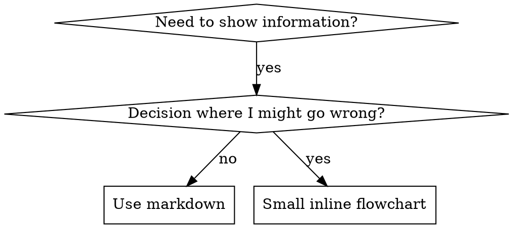

# Writing Skills for Prodige

## Overview

**Writing skills IS Test-Driven Development applied to process documentation.**

**Prodige skills live in `.ai/skills/`** — each skill gets its own directory following Prodige's structure. Skills integrate with Prodige's governance system, commands, and runtime tracking.

You write test cases (pressure scenarios with subagents), watch them fail (baseline behavior), write the skill (documentation), watch tests pass (agents comply), and refactor (close loopholes).

**Core principle:** If you didn't watch an agent fail without the skill, you don't know if the skill teaches the right thing.

**REQUIRED BACKGROUND:** You MUST understand test-driven-development before using this skill. That skill defines the fundamental RED-GREEN-REFACTOR cycle. This skill adapts TDD to documentation.

## What is a Prodige Skill?

A **skill** is a reference guide for proven techniques, patterns, or tools within the Prodige workflow. Skills help future agents find and apply effective approaches while maintaining Prodige's governance standards.

**Skills are:** Reusable techniques, patterns, tools, reference guides integrated with Prodige's system

**Skills are NOT:** Narratives about how you solved a problem once, or standalone docs disconnected from Prodige commands

## TDD Mapping for Skills

| TDD Concept | Skill Creation |
|-------------|----------------|
| **Test case** | Pressure scenario with subagent |
| **Production code** | Skill document (SKILL.md) |
| **Test fails (RED)** | Agent violates rule without skill (baseline) |
| **Test passes (GREEN)** | Agent complies with skill present |
| **Refactor** | Close loopholes while maintaining compliance |
| **Write test first** | Run baseline scenario BEFORE writing skill |
| **Watch it fail** | Document exact rationalizations agent uses |
| **Minimal code** | Write skill addressing those specific violations |
| **Watch it pass** | Verify agent now complies |
| **Refactor cycle** | Find new rationalizations → plug → re-verify |

The entire skill creation process follows RED-GREEN-REFACTOR.

## When to Create a Skill

**Create when:**
- Technique wasn't intuitively obvious to you
- You'd reference this again across projects
- Pattern applies broadly (not project-specific)
- Others would benefit
- Integrates with Prodige commands or governance


**Don't create for:**
- One-off solutions
- Standard practices well-documented elsewhere
- Project-specific conventions (put in `.ai/context/ARCHITECTURE.md` or `.ai/context/DECISIONS.md`)
- Mechanical constraints (if it's enforceable with regex/validation, automate it—save documentation for judgment calls)

## Skill Types

### Technique
Concrete method with steps to follow (using-git-worktrees, systematic-debugging)

### Pattern
Way of thinking about problems (subagent-driven-development, brainstorming)

### Reference
API docs, syntax guides, tool documentation (ripgrep, repomap)

### Integration
Connects Prodige components (finishing-a-development-branch, requesting-code-review)

## Prodige Skill Structure

### Directory Layout

```
.ai/skills/
  skill-name/
    SKILL.md              # Main reference (required)
    supporting-file.*     # Only if needed
    scripts/              # Reusable automation (optional)
```

**Flat namespace** - all skills in one searchable namespace under `.ai/skills/`

**Separate files for:**
1. **Heavy reference** (100+ lines) - API docs, comprehensive syntax
2. **Reusable tools** - Scripts, utilities, templates (in `scripts/`)
3. **Prompt templates** - Subagent dispatch templates (e.g., `implementer-prompt.md`)

**Keep inline:**
- Principles and concepts
- Code patterns (< 50 lines)
- Everything else


## SKILL.md Structure for Prodige

**Frontmatter (YAML):**
- Two required fields: `name` and `description`
- Max 1024 characters total
- `name`: Use letters, numbers, and hyphens only (no parentheses, special chars)
- `description`: Third-person, describes ONLY when to use (NOT what it does)
  - Start with "Use when..." to focus on triggering conditions
  - Include specific symptoms, situations, and contexts
  - **NEVER summarize the skill's process or workflow** (see SDO section for why)
  - Keep under 500 characters if possible

```markdown
---
name: skill-name-with-hyphens
description: Use when [specific triggering conditions and symptoms] - include Prodige integration context
---

# Skill Name

## Overview
What is this? Core principle in 1-2 sentences.
How does it integrate with Prodige's system?

## Integration with Prodige
- Which commands invoke this skill?
- Which governance gates does it support?
- Which runtime files does it use/update?
- Which other skills does it depend on?

## When to Use
[Small inline flowchart IF decision non-obvious]

Bullet list with SYMPTOMS and use cases
When NOT to use

## Core Pattern (for techniques/patterns)
Before/after code comparison
Integration examples with Prodige commands

## Quick Reference
Table or bullets for scanning common operations

## Implementation
Inline code for simple patterns
Link to file for heavy reference or reusable tools
Reference Prodige file locations (`.ai/runtime/`, `.ai/context/`)

## Common Mistakes
What goes wrong + fixes
Prodige-specific gotchas

## Red Flags
Never/Always lists
Prodige governance violations to avoid

## Governance Integration Summary (if applicable)
How this skill fits in Prodige's review gate workflow
```


## Skill Discovery Optimization (SDO)

**Critical for discovery:** Future agents need to FIND your skill in Prodige's `.ai/skills/` directory

### 1. Rich Description Field

**Purpose:** Your agent reads the description to decide which skills to load for a given task. Make it answer: "Should I read this skill right now?"

**Format:** Start with "Use when..." to focus on triggering conditions

**CRITICAL: Description = When to Use, NOT What the Skill Does**

The description should ONLY describe triggering conditions. Do NOT summarize the skill's process or workflow in the description.

**Why this matters:** Testing revealed that when a description summarizes the skill's workflow, an agent may follow the description instead of reading the full skill content. A description saying "code review between tasks" caused an agent to do ONE review, even though the skill's flowchart clearly showed TWO reviews (spec compliance then code quality).

When the description was changed to just "Use when executing implementation plans with independent tasks" (no workflow summary), the agent correctly read the flowchart and followed the two-stage review process.

**The trap:** Descriptions that summarize workflow create a shortcut agents will take. The skill body becomes documentation agents skip.

```yaml
# ❌ BAD: Summarizes workflow - agents may follow this instead of reading skill
description: Use when executing plans - dispatches subagent per task with code review between tasks

# ❌ BAD: Too much process detail
description: Use for TDD - write test first, watch it fail, write minimal code, refactor

# ✅ GOOD: Just triggering conditions, no workflow summary, includes Prodige context
description: Use when executing implementation plans with independent tasks in the current session

# ✅ GOOD: Triggering conditions only with Prodige integration
description: Use when implementation is complete, all tests pass, and you need to decide how to integrate the work through Prodige's Release Gate
```

**Content:**
- Use concrete triggers, symptoms, and situations that signal this skill applies
- Describe the *problem* (race conditions, inconsistent behavior) not *language-specific symptoms* (setTimeout, sleep)
- Keep triggers technology-agnostic unless the skill itself is technology-specific
- If skill is technology-specific, make that explicit in the trigger
- Write in third person (injected into system prompt)
- **Include Prodige-specific context** (which commands, which gates, which workflow phase)
- **NEVER summarize the skill's process or workflow**


```yaml
# ❌ BAD: Too abstract, vague, doesn't include when to use
description: For async testing

# ❌ BAD: First person
description: I can help you with async tests when they're flaky

# ❌ BAD: Mentions technology but skill isn't specific to it
description: Use when tests use setTimeout/sleep and are flaky

# ✅ GOOD: Starts with "Use when", describes problem, no workflow
description: Use when tests have race conditions, timing dependencies, or pass/fail inconsistently

# ✅ GOOD: Technology-specific skill with explicit trigger and Prodige context
description: Use when starting feature work in Prodige that needs isolation from current workspace - ensures an isolated workspace exists via native tools or git worktree fallback

# ✅ GOOD: Integration skill with clear Prodige context
description: Use when implementation is complete, all tests pass, and you need to decide how to integrate the work - guides completion of development work through Prodige's Release Gate by presenting structured options for merge, PR, or cleanup
```

### 2. Keyword Coverage

Use words an agent would search for:
- Error messages: "Hook timed out", "ENOTEMPTY", "race condition"
- Symptoms: "flaky", "hanging", "zombie", "pollution"
- Synonyms: "timeout/hang/freeze", "cleanup/teardown/afterEach"
- Tools: Actual commands, library names, file types
- **Prodige-specific:** Command names (`/build`, `/parallel`), file paths (`.ai/runtime/`, `.ai/context/`), gate names (Release Gate, Review Gate)

### 3. Descriptive Naming

**Use active voice, verb-first:**
- ✅ `creating-skills` not `skill-creation`
- ✅ `finishing-a-development-branch` not `branch-completion`
- ✅ `using-git-worktrees` not `worktree-usage`

### 4. Token Efficiency (Critical)

**Problem:** Frequently-referenced skills load into EVERY conversation. Every token counts.

**Target word counts:**
- Getting-started workflows: <150 words each
- Frequently-loaded skills: <200 words total
- Other skills: <500 words (still be concise)
- Integration skills with Prodige: <800 words (more context needed)

**Techniques:**

**Move details to tool help:**
```bash
# ❌ BAD: Document all flags in SKILL.md
search-conversations supports --text, --both, --after DATE, --before DATE, --limit N

# ✅ GOOD: Reference --help
search-conversations supports multiple modes and filters. Run --help for details.
```


**Use cross-references:**
```markdown
# ❌ BAD: Repeat workflow details
When searching, dispatch subagent with template...
[20 lines of repeated instructions]

# ✅ GOOD: Reference other skill
Always use subagents (50-100x context savings). REQUIRED: Use subagent-driven-development for workflow.
```

**Compress examples:**
```markdown
# ❌ BAD: Verbose example (42 words)
your human partner: "How did we handle authentication errors in React Router before?"
You: I'll search past conversations for React Router authentication patterns.
[Dispatch subagent with search query: "React Router authentication error handling 401"]

# ✅ GOOD: Minimal example (20 words)
Partner: "How did we handle auth errors in React Router?"
You: Searching...
[Dispatch subagent → synthesis]
```

**Eliminate redundancy:**
- Don't repeat what's in cross-referenced skills
- Don't explain what's obvious from command
- Don't include multiple examples of same pattern
- **Leverage Prodige's existing docs:** Reference `.ai/governance/review-gates.md` instead of repeating gate definitions

**Verification:**
```bash
wc -w .ai/skills/skill-name/SKILL.md
# Getting-started workflows: aim for <150 each
# Frequently-loaded: aim for <200 total
# Integration skills: aim for <800
```

### 5. Cross-Referencing Other Skills

**When writing documentation that references other skills:**

Use skill name only, with explicit requirement markers:
- ✅ Good: `**REQUIRED SUB-SKILL:** Use test-driven-development`
- ✅ Good: `**REQUIRED BACKGROUND:** You MUST understand systematic-debugging`
- ✅ Good: `See using-git-worktrees for workspace isolation`
- ❌ Bad: `See .ai/skills/using-git-worktrees/SKILL.md` (too verbose)
- ❌ Bad: Generic "see docs" without skill name

**Prodige-specific cross-references:**
- Commands: Reference by name (e.g., "Invoked by `/build` command")
- Governance: Reference gate files (e.g., "See `.ai/governance/review-gates.md`")
- Context: Reference context files (e.g., "Updates `.ai/context/CHANGELOG.md`")
- Runtime: Reference runtime files (e.g., "Tracks in `.ai/runtime/worktrees.json`")


## Flowchart Usage



**Use flowcharts ONLY for:**
- Non-obvious decision points
- Process loops where you might stop too early
- "When to use A vs B" decisions
- Integration flows between Prodige components

**Never use flowcharts for:**
- Reference material → Tables, lists
- Code examples → Markdown blocks
- Linear instructions → Numbered lists
- Labels without semantic meaning (step1, helper2)

**Prodige-specific flowcharts:**
- Show integration between commands, skills, and gates
- Illustrate workflow transitions (Design → Build → Review → Release)
- Map decision trees for command selection

## Code Examples

**One excellent example beats many mediocre ones**

Choose most relevant language:
- Testing techniques → TypeScript/JavaScript (Prodige's primary stack)
- System debugging → Shell/PowerShell (Prodige runs on both Unix and Windows)
- Data processing → Python

**Good example:**
- Complete and runnable
- Well-commented explaining WHY
- From real scenario
- Shows pattern clearly
- Ready to adapt (not generic template)
- **Integrates with Prodige:** References `.ai/` structure, uses Prodige commands

**Don't:**
- Implement in 5+ languages
- Create fill-in-the-blank templates
- Write contrived examples


## File Organization in Prodige

### Self-Contained Skill
```
.ai/skills/
  systematic-debugging/
    SKILL.md    # Everything inline
```
When: All content fits, no heavy reference needed

### Skill with Reusable Tool
```
.ai/skills/
  subagent-driven-development/
    SKILL.md                    # Overview + patterns
    implementer-prompt.md       # Subagent dispatch template
    task-reviewer-prompt.md     # Task review template
    scripts/
      task-brief                # Extract task from plan
      review-package            # Generate review diff package
```
When: Tool is reusable code or template, not just narrative

### Skill with Heavy Reference
```
.ai/skills/
  ripgrep/
    SKILL.md       # Overview + workflows
    patterns.md    # 600 lines pattern reference
    examples.md    # 500 lines examples
    scripts/       # Executable tools
```
When: Reference material too large for inline

### Integration Skill (Prodige-specific)
```
.ai/skills/
  finishing-a-development-branch/
    SKILL.md                    # Main skill with Prodige integration
    release-gate-checklist.md   # Gate verification steps (optional)
```
When: Skill bridges Prodige components (commands, gates, runtime)

## The Iron Law (Same as TDD)

```
NO SKILL WITHOUT A FAILING TEST FIRST
```

This applies to NEW skills AND EDITS to existing skills.

Write skill before testing? Delete it. Start over.
Edit skill without testing? Same violation.

**No exceptions:**
- Not for "simple additions"
- Not for "just adding a section"
- Not for "documentation updates"
- Don't keep untested changes as "reference"
- Don't "adapt" while running tests
- Delete means delete

**REQUIRED BACKGROUND:** The test-driven-development skill explains why this matters. Same principles apply to documentation.


## Testing All Skill Types

Different skill types need different test approaches:

### Discipline-Enforcing Skills (rules/requirements)

**Examples:** test-driven-development, verification-before-completion

**Test with:**
- Academic questions: Do they understand the rules?
- Pressure scenarios: Do they comply under stress?
- Multiple pressures combined: time + sunk cost + exhaustion
- Identify rationalizations and add explicit counters

**Success criteria:** Agent follows rule under maximum pressure

### Technique Skills (how-to guides)

**Examples:** using-git-worktrees, systematic-debugging

**Test with:**
- Application scenarios: Can they apply the technique correctly?
- Variation scenarios: Do they handle edge cases?
- Missing information tests: Do instructions have gaps?

**Success criteria:** Agent successfully applies technique to new scenario

### Pattern Skills (mental models)

**Examples:** subagent-driven-development, brainstorming

**Test with:**
- Recognition scenarios: Do they recognize when pattern applies?
- Application scenarios: Can they use the mental model?
- Counter-examples: Do they know when NOT to apply?

**Success criteria:** Agent correctly identifies when/how to apply pattern

### Reference Skills (documentation/APIs)

**Examples:** ripgrep, repomap

**Test with:**
- Retrieval scenarios: Can they find the right information?
- Application scenarios: Can they use what they found correctly?
- Gap testing: Are common use cases covered?

**Success criteria:** Agent finds and correctly applies reference information

### Integration Skills (Prodige-specific)

**Examples:** finishing-a-development-branch, requesting-code-review

**Test with:**
- Cross-component scenarios: Does skill correctly integrate commands, gates, and runtime?
- Governance scenarios: Does skill enforce correct gate progression?
- Edge cases: Parallel workflows, rollback scenarios, cleanup edge cases

**Success criteria:** Agent correctly navigates Prodige's governance system and updates all required files


## Common Rationalizations for Skipping Testing

| Excuse | Reality |
|--------|---------|
| "Skill is obviously clear" | Clear to you ≠ clear to other agents. Test it. |
| "It's just a reference" | References can have gaps, unclear sections. Test retrieval. |
| "Testing is overkill" | Untested skills have issues. Always. 15 min testing saves hours. |
| "I'll test if problems emerge" | Problems = agents can't use skill. Test BEFORE deploying. |
| "Too tedious to test" | Testing is less tedious than debugging bad skill in production. |
| "I'm confident it's good" | Overconfidence guarantees issues. Test anyway. |
| "Academic review is enough" | Reading ≠ using. Test application scenarios. |
| "No time to test" | Deploying untested skill wastes more time fixing it later. |
| "It's just a Prodige integration update" | Integration changes can break workflows. Test them. |

**All of these mean: Test before deploying. No exceptions.**

## Match the Form to the Failure

Before writing guidance, classify the baseline failure. The form that bulletproofs one failure type measurably backfires on another.

| Baseline failure | Right form | Wrong form |
|---|---|---|
| Skips/violates a rule under pressure (knows better, does it anyway) | Prohibition + rationalization table + red flags (see Bulletproofing below) | Soft guidance ("prefer...", "consider...") |
| Complies, but output has the wrong shape (bloated prompt, buried verdict, restated spec) | Positive recipe or contract: state what the output IS — its parts, in order | Prohibition list ("don't restate", "never narrate") |
| Omits a required element from something they already produce | Structural: REQUIRED field or slot in the template they fill in | Prose reminders near the template |
| Behavior should depend on a condition | Conditional keyed to an observable predicate ("if the brief exists, reference it") | Unconditional rule + exemption clauses |
| Skips Prodige governance step | Hard gate with checklist + verification steps | Soft reminder to "follow governance" |

**Why prohibitions backfire on shaping problems:** under a competing incentive ("make the prompt self-contained"), agents negotiate with "don't X". In head-to-head wording tests on dispatch-prompt guidance, the prohibition arm produced clearly more of the unwanted content than the recipe arm (fully separated distributions), and trended worse than even the no-guidance control — micro-test your own case rather than assuming, but never reach for the prohibition by default. A recipe leaves nothing to negotiate: the output matches the stated shape or it doesn't.


**Rules for whichever form you pick:**
- **No nuance clauses.** "Don't X unless it matters" reopens the negotiation — appending a single nuance clause to a winning recipe degraded it from consistent to noisy in the same wording tests. Express a real exception as its own conditional on an observable predicate.
- **Exemption clauses don't scope.** "This limit doesn't apply to code blocks" still suppresses code blocks. If part of the output must be exempt, restructure so the rule can't reach it.

## Bulletproofing Skills Against Rationalization

Skills that enforce discipline (like TDD) need to resist rationalization. Agents are smart and will find loopholes when under pressure.

**Scope:** this toolkit is for discipline failures — an agent that knows the rule and skips it under pressure. For wrong-shaped output or omitted elements, prohibition-based bulletproofing backfires; use the forms in Match the Form to the Failure instead.

### Close Every Loophole Explicitly

Don't just state the rule - forbid specific workarounds:

**Bad:**
```markdown
Write code before test? Delete it.
```

**Good:**
```markdown
Write code before test? Delete it. Start over.

**No exceptions:**
- Don't keep it as "reference"
- Don't "adapt" it while writing tests
- Don't look at it
- Delete means delete
```

### Address "Spirit vs Letter" Arguments

Add foundational principle early:

```markdown
**Violating the letter of the rules is violating the spirit of the rules.**
```

This cuts off entire class of "I'm following the spirit" rationalizations.

### Build Rationalization Table

Capture rationalizations from baseline testing (see Testing section below). Every excuse agents make goes in the table:

```markdown
| Excuse | Reality |
|--------|---------|
| "Too simple to test" | Simple code breaks. Test takes 30 seconds. |
| "I'll test after" | Tests passing immediately prove nothing. |
| "Tests after achieve same goals" | Tests-after = "what does this do?" Tests-first = "what should this do?" |
```


### Create Red Flags List

Make it easy for agents to self-check when rationalizing:

```markdown
## Red Flags - STOP and Start Over

- Code before test
- "I already manually tested it"
- "Tests after achieve the same purpose"
- "It's about spirit not ritual"
- "This is different because..."

**All of these mean: Delete code. Start over with TDD.**
```

### Update SDO for Violation Symptoms

Add to description: symptoms of when you're ABOUT to violate the rule:

```yaml
description: use when implementing any feature or bugfix, before writing implementation code
```

### Prodige-Specific Bulletproofing

For Prodige governance skills:

```markdown
## Hard Gates - Cannot Proceed Without

- [ ] Release Gate checklist complete
- [ ] All tests passing
- [ ] CHANGELOG.md updated
- [ ] No unresolved governance violations

**Skipping any item = governance violation. STOP.**
```

## RED-GREEN-REFACTOR for Skills

Follow the TDD cycle:

### RED: Write Failing Test (Baseline)

Run pressure scenario with subagent WITHOUT the skill. Document exact behavior:
- What choices did they make?
- What rationalizations did they use (verbatim)?
- Which pressures triggered violations?
- **Prodige-specific:** Did they skip governance steps? Update wrong files? Ignore gates?

This is "watch the test fail" - you must see what agents naturally do before writing the skill.

### GREEN: Write Minimal Skill

Write skill that addresses those specific rationalizations. Don't add extra content for hypothetical cases.

**Prodige-specific additions:**
- Integration section: Which commands, gates, runtime files
- Governance section: Which gates this skill supports
- Context updates: Which `.ai/context/` files to update

Run same scenarios WITH skill. Agent should now comply.


### REFACTOR: Close Loopholes

Agent found new rationalization? Add explicit counter. Re-test until bulletproof.

**Prodige-specific refactoring:**
- Add missing governance checkpoints
- Clarify file location ambiguities (`.ai/runtime/` vs `.ai/context/`)
- Strengthen gate integration
- Add cross-references to related skills

### Micro-Test Wording Before Full Scenarios

Full pressure-scenario runs are the final gate, but they are slow and expensive per iteration. Verify the wording itself first with micro-tests:

1. **One fresh-context sample per call** — a raw API call, or a single-shot subagent if you don't have API access. System prompt = the realistic context the guidance will live in (the full skill or prompt template, not the guidance in isolation); user message = a task that tempts the failure.
2. **Always include a no-guidance control.** If the control doesn't exhibit the failure, there is nothing to fix — stop, don't author the guidance.
3. **5+ reps per variant.** Single samples lie.
4. **Manually read every flagged match.** Score programmatically if you like, but template echoes and quoted counter-examples masquerade as hits; automated counts alone overstate both failure and success.
5. **Variance is a metric.** When guidance lands, reps converge on the same shape. Five different interpretations across five reps means the wording isn't binding — tighten the form before adding words.

Micro-tests verify wording; they do not replace pressure scenarios for discipline skills.

## Anti-Patterns

### ❌ Narrative Example
"In session 2025-10-03, we found empty projectDir caused..."
**Why bad:** Too specific, not reusable

### ❌ Multi-Language Dilution
example-js.js, example-py.py, example-go.go
**Why bad:** Mediocre quality, maintenance burden

### ❌ Code in Flowcharts
```dot
step1 [label="import fs"];
step2 [label="read file"];
```
**Why bad:** Can't copy-paste, hard to read

### ❌ Generic Labels
helper1, helper2, step3, pattern4
**Why bad:** Labels should have semantic meaning

### ❌ Disconnected from Prodige (Prodige-specific)
Skill doesn't mention which commands use it, which gates it supports, or which files it updates
**Why bad:** Agents can't integrate skill with Prodige workflow


## STOP: Before Moving to Next Skill

**After writing ANY skill, you MUST STOP and complete the deployment process.**

**Do NOT:**
- Create multiple skills in batch without testing each
- Move to next skill before current one is verified
- Skip testing because "batching is more efficient"

**The deployment checklist below is MANDATORY for EACH skill.**

Deploying untested skills = deploying untested code. It's a violation of quality standards.

## Skill Creation Checklist (TDD Adapted)

**IMPORTANT: Create a todo for EACH checklist item below.**

**RED Phase - Write Failing Test:**
- [ ] Create pressure scenarios (3+ combined pressures for discipline skills)
- [ ] Run scenarios WITHOUT skill - document baseline behavior verbatim
- [ ] Identify patterns in rationalizations/failures
- [ ] **Prodige-specific:** Test governance integration, file updates, gate compliance

**GREEN Phase - Write Minimal Skill:**
- [ ] Name uses only letters, numbers, hyphens (no parentheses/special chars)
- [ ] YAML frontmatter with required `name` and `description` fields (max 1024 chars)
- [ ] Description starts with "Use when..." and includes specific triggers/symptoms
- [ ] Description includes Prodige integration context (commands, gates, workflow phase)
- [ ] Description written in third person
- [ ] Keywords throughout for search (errors, symptoms, tools, Prodige components)
- [ ] Clear overview with core principle
- [ ] **Integration with Prodige section:** Commands, gates, runtime files, dependencies
- [ ] Address specific baseline failures identified in RED
- [ ] Guidance form matches the failure type (see Match the Form to the Failure)
- [ ] For behavior-shaping guidance: wording micro-tested against a no-guidance control (5+ reps, every flagged match read manually) — N/A for pure reference skills
- [ ] Code inline OR link to separate file
- [ ] One excellent example (not multi-language)
- [ ] **Prodige file locations correct:** `.ai/skills/`, `.ai/runtime/`, `.ai/context/`, `.ai/governance/`
- [ ] Run scenarios WITH skill - verify agents now comply


**REFACTOR Phase - Close Loopholes:**
- [ ] Identify NEW rationalizations from testing
- [ ] Add explicit counters (if discipline skill)
- [ ] Build rationalization table from all test iterations
- [ ] Create red flags list
- [ ] **Prodige-specific:** Add governance checkpoints, clarify file locations, strengthen gate integration
- [ ] Re-test until bulletproof

**Quality Checks:**
- [ ] Small flowchart only if decision non-obvious
- [ ] Quick reference table
- [ ] Common mistakes section
- [ ] Red Flags section (Never/Always lists)
- [ ] No narrative storytelling
- [ ] Supporting files only for tools or heavy reference
- [ ] **Governance Integration Summary (if applicable):** How skill fits in review gate workflow

**Deployment:**
- [ ] Skill file in correct location: `.ai/skills/<skill-name>/SKILL.md`
- [ ] Update `.ai/skills/manifest.json` if it exists (list new skill)
- [ ] Commit skill to git and push to repository
- [ ] Test skill integration with relevant Prodige commands (`/build`, `/parallel`, etc.)
- [ ] Verify skill appears in skill discovery (can agents find it?)

## Discovery Workflow in Prodige

How future agents find your skill:

1. **Command invocation** (`/build`, `/parallel`, `/design`)
2. **Searches `.ai/skills/`** (greps descriptions, browses directories)
3. **Finds SKILL.md** (description matches task + Prodige context)
4. **Scans overview** (is this relevant? How does it integrate?)
5. **Reads Integration with Prodige** (which commands, gates, files?)
6. **Reads patterns** (quick reference table)
7. **Loads example** (only when implementing)

**Optimize for this flow** - put searchable terms and Prodige integration context early and often.

## Prodige-Specific Integration Patterns

### Command Integration

Skills invoked by commands should document the trigger:

```markdown
## Integration with Prodige

**Commands that invoke this skill:**
- `/build` - After all implementation tasks complete
- `/parallel` - After parallel agents finish
- Manual invocation when ready to complete work

**Preconditions:**
- All tests passing
- Review Gate passed
```


### Governance Gate Integration

Skills that support governance gates should document their role:

```markdown
## Governance Integration Summary

This skill is the final step in Prodige's governance workflow:

```
PRD Gate → Architecture Gate → Implementation Gate → Review Gate → **Release Gate** → Merge/PR
```

**Release Gate ensures:**
- All tests passing
- Code review complete
- Documentation current
- Breaking changes documented
- Governance requirements met
```

### Runtime File Integration

Skills that read/write runtime files should document the contract:

```markdown
## Runtime File Integration

**Reads:**
- `.ai/runtime/worktrees.json` - Worktree provenance tracking
- `.ai/runtime/locks/` - Parallel coordination locks

**Writes:**
- `.ai/runtime/worktrees.json` - Updates worktree status on completion
- `.ai/context/CHANGELOG.md` - Records merge events

**Format:**
```json
{
  "worktrees": [
    {
      "path": "/path/to/.worktrees/feature-branch",
      "branch": "feature-branch",
      "created": "2024-01-15T10:30:00Z",
      "createdBy": "using-git-worktrees",
      "status": "active"
    }
  ]
}
```
```

### Context File Integration

Skills that update context should document what and when:

```markdown
## Context Updates

**On successful merge (Option 1):**
- Update `.ai/context/CHANGELOG.md` with merge entry
- Update `.ai/context/DECISIONS.md` if architectural decision made
- Update `.ai/context/ARCHITECTURE.md` if structure changed

**Format:**
```markdown
## [2024-01-15] - Feature: User Authentication
### Changes
- Added JWT authentication middleware
- Implemented login/logout endpoints
```
```


## The Bottom Line

**Creating skills IS TDD for process documentation in Prodige.**

Same Iron Law: No skill without failing test first.
Same cycle: RED (baseline) → GREEN (write skill) → REFACTOR (close loopholes).
Same benefits: Better quality, fewer surprises, bulletproof results.

**Prodige additions:**
- Integration with commands, gates, and runtime
- Governance compliance verification
- Context and runtime file contracts
- Cross-skill coordination

If you follow TDD for code, follow it for skills. It's the same discipline applied to documentation, with Prodige's governance system ensuring quality and consistency.

## Quick Reference: Prodige Skill Template

```markdown
---
name: skill-name
description: Use when [trigger] - [Prodige integration context]
---

# Skill Name

## Overview
Core principle. Prodige integration summary.

## Integration with Prodige
- Commands: Which invoke this
- Gates: Which this supports
- Runtime: Which files this uses/updates
- Dependencies: Which skills this requires

## When to Use
[Flowchart if non-obvious decision]
Symptoms and use cases

## Core Pattern
Implementation details

## Quick Reference
Table of common operations

## Common Mistakes
What goes wrong + fixes

## Red Flags
Never/Always lists

## Governance Integration Summary (if applicable)
How this fits in review gate workflow
```

## Example: Integration Skill Structure

See `finishing-a-development-branch/SKILL.md` for a complete example of:
- Release Gate integration
- Command integration (`/build`, `/parallel`)
- Runtime file tracking (`.ai/runtime/worktrees.json`)
- Context updates (`.ai/context/CHANGELOG.md`)
- Governance compliance verification
- Cross-skill coordination (using-git-worktrees, requesting-code-review)

This is a reference implementation of Prodige skill TDD methodology.
